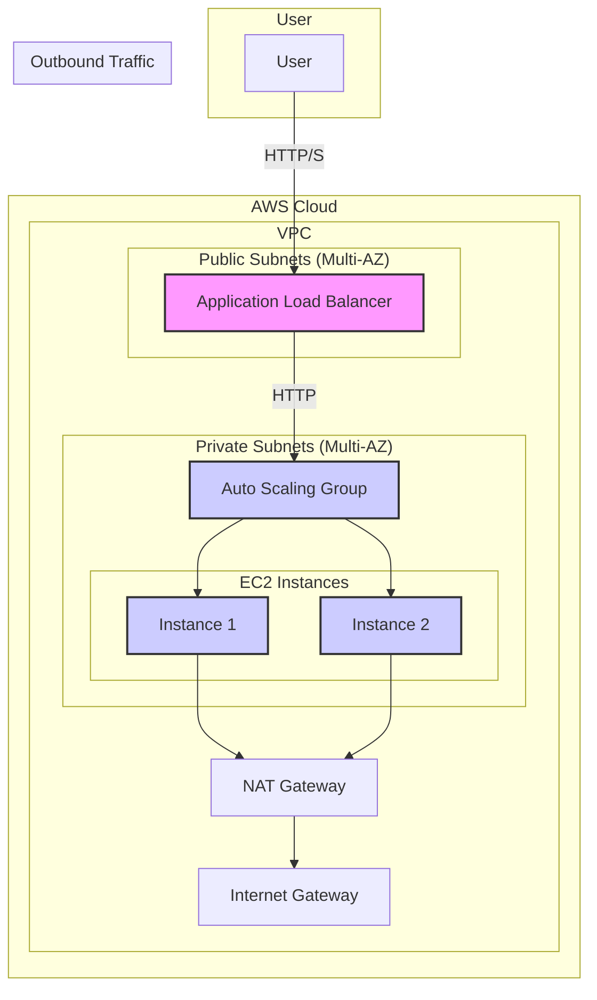

```mermaid
graph TD
    subgraph "User"
        U[User]
    end

    subgraph "AWS Cloud"
        subgraph "VPC"
            subgraph "Public Subnets (Multi-AZ)"
                ALB[Application Load Balancer]
            end

            subgraph "Private Subnets (Multi-AZ)"
                ASG[Auto Scaling Group]
                subgraph "EC2 Instances"
                    direction LR
                    I1[Instance 1]
                    I2[Instance 2]
                end
            end

            IGW[Internet Gateway]
            NAT[NAT Gateway]
        end
    end

    U -->|HTTP/S| ALB
    ALB -->|HTTP| ASG
    ASG --> I1
    ASG --> I2

    subgraph "Outbound Traffic"
        direction LR
        I1 --> NAT
        I2 --> NAT
        NAT --> IGW
    end

    style ALB fill:#f9f,stroke:#333,stroke-width:2px
    style ASG fill:#ccf,stroke:#333,stroke-width:2px
    style I1 fill:#ccf,stroke:#333,stroke-width:2px
    style I2 fill:#ccf,stroke:#333,stroke-width:2px
```
