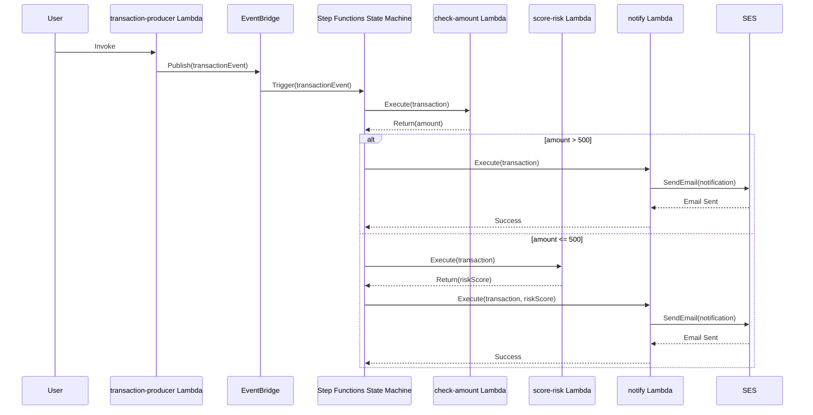

# Risk Scoring Workflow

```mermaid
sequenceDiagram
    participant User
    participant transaction-producer as transaction-producer Lambda
    participant EventBridge
    participant StepFunctions as Step Functions State Machine
    participant check-amount as check-amount Lambda
    participant score-risk as score-risk Lambda
    participant notify as notify Lambda
    participant SES

    User->>transaction-producer: Invoke
    transaction-producer->>EventBridge: Publish(transactionEvent)
    EventBridge->>StepFunctions: Trigger(transactionEvent)
    StepFunctions->>check-amount: Execute(transaction)
    check-amount-->>StepFunctions: Return(amount)
    alt amount > 500
        StepFunctions->>notify: Execute(transaction)
        notify->>SES: SendEmail(notification)
        SES-->>notify: Email Sent
        notify-->>StepFunctions: Success
    else amount <= 500
        StepFunctions->>score-risk: Execute(transaction)
        score-risk-->>StepFunctions: Return(riskScore)
        StepFunctions->>notify: Execute(transaction, riskScore)
        notify->>SES: SendEmail(notification)
        SES-->>notify: Email Sent
        notify-->>StepFunctions: Success
    end
```