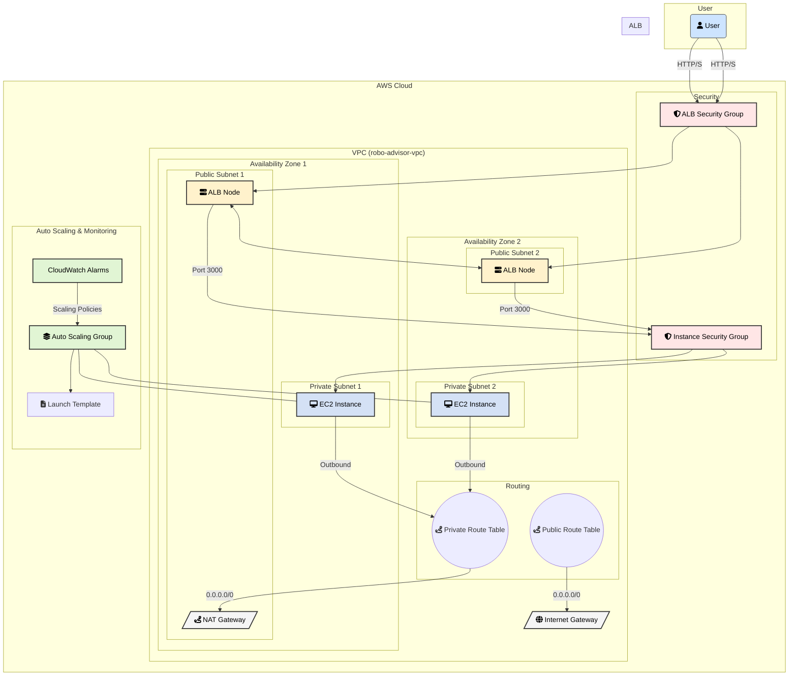

## Stress, Failure Scenarios & Edge Cases

This section outlines potential traffic patterns, load scenarios, and operational edge cases that could stress, break, or degrade the system as designed. Understanding these helps in identifying areas for future improvement and hardening.

### Traffic and Load Scenarios

#### 1. Sudden, Extreme Traffic Spikes (Thundering Herd)
-   **Scenario**: A major market event (e.g., a stock market crash or a major IPO) triggers a massive, simultaneous influx of users.
-   **Potential Impact**: Reactive auto-scaling policies need time to respond. The lag in launching and warming up new EC2 instances can overwhelm existing instances, causing high latency and 5xx errors.

#### 2. High-Concurrency Outbound Traffic
-   **Scenario**: The application makes a high volume of concurrent outbound API calls to third-party financial data providers.
-   **Potential Impact**: The single NAT Gateway, despite being scalable, can become a bottleneck with its limit of 55,000 simultaneous connections per destination, leading to port exhaustion and connection timeouts.

#### 3. CPU-Intensive Workloads
-   **Scenario**: A large number of users simultaneously trigger a CPU-heavy feature like on-demand portfolio analysis.
-   **Potential Impact**: A sharp, bursty CPU load can degrade performance fleet-wide before the 5-minute average CPU alarm triggers a scale-out event.

#### 4. Unpredictable Traffic Patterns
-   **Scenario**: Traffic spikes due to unpredictable events (e.g., a viral social media mention) that do not align with historical patterns.
-   **Potential Impact**: Predictive Scaling may fail to provision capacity in advance, forcing the system to rely on slower, reactive scaling and causing temporary under-provisioning.

#### 5. Denial of Service (DoS/DDoS) Attacks
-   **Scenario**: A malicious actor targets the service with a high-volume flood of traffic at Layer 4 or Layer 7.
-   **Potential Impact**: Without a dedicated WAF or AWS Shield Advanced, the system is vulnerable. While the infrastructure will attempt to scale, it can be overwhelmed, leading to service unavailability and significant cost overruns.

### Operational Edge Cases

-   **Cold Start Latency**: New EC2 instances require time to launch and bootstrap, delaying their ability to serve traffic and contribute to handling load.
-   **Health Check Flapping**: Poorly configured health checks can cause healthy instances to be terminated and re-launched unnecessarily, leading to instability.
-   **Delayed Deregistration**: Slow deregistration from the load balancer can result in traffic being sent to terminating or unhealthy instances.
-   **Overly Aggressive Scale-In**: Terminating instances too quickly can cut off active user connections, causing errors and a poor user experience.
-   **Launch Capacity Limits**: Scaling activities can fail if they hit regional EC2 instance quotas or if a specific Availability Zone lacks capacity for the requested instance type.
-   **Warm-up vs. Cooldown Timing**: If the scaling cooldown period is shorter than the instance warm-up time, the Auto Scaling Group may scale in prematurely by terminating instances that are not yet fully operational.
-   **State Loss in Stateless Architecture**: In a supposedly stateless application, if any state is inadvertently held on an instance (e.g., in-memory session data), it will be lost when the instance is terminated.
-   **Partial Dependency Failures**: The application can become unhealthy due to downstream issues (e.g., a throttled database or a slow third-party API), even if the EC2 instances themselves are fine. Health checks must be designed to detect these external dependencies.

---

## Architectural Learnings & Mitigation Strategies

This analysis leads to several key architectural takeaways and potential improvements.

### 1. Tuning and Hardening the Current EC2-Based Architecture

Many of the identified risks can be mitigated with more sophisticated configuration and patterns:

| Issue | Mitigation Strategy |
| :--- | :--- |
| **Traffic Spikes & Cold Starts** | - **Instance Warm-up:** Use ASG lifecycle hooks or warm pools to pre-initialize instances before they accept traffic.   - **Golden AMIs:** Create custom Amazon Machine Images with all dependencies pre-installed to drastically reduce bootstrap time.   - **Aggressive Scaling:** Tune scaling policies to react faster, or use Predictive Scaling with a higher buffer to over-provision slightly ahead of forecasted demand. |
| **Health Checks & Deregistration** | - **Target Group Settings:** Fine-tune health check thresholds (e.g., require more consecutive failures before marking an instance unhealthy) and reduce the deregistration delay to remove failed instances from rotation faster.   - **Deep Health Checks:** Implement a dedicated `/health` endpoint in the application that verifies its own critical dependencies (database, external APIs) before returning a 200 OK. |
| **Aggressive Scale-In** | - **Scale-in Protection:** Enable instance scale-in protection to prevent the ASG from terminating instances that are handling long-running tasks.   - **Lifecycle Hooks:** Use a `Terminating:Wait` lifecycle hook to allow an instance to finish active connections before it's fully shut down. |
| **Capacity & Dependency Failure** | - **Diverse Instance Types:** Configure the ASG to use multiple instance types (e.g., m5.large, m6i.large) to reduce the risk of a stockout in a single AZ.   - **Circuit Breakers:** Implement a circuit breaker pattern (e.g., using a library like Resilience4j or Polly) in the application to gracefully handle slow or failing downstream services. |
| **Security & NAT Gateway** | - **AWS WAF & Shield:** Protect the ALB with a Web Application Firewall (WAF) to block common web exploits and subscribe to Shield Advanced for robust DDoS mitigation.   - **Multiple NAT Gateways:** For extreme outbound traffic needs, deploy NAT gateways in each AZ to improve resilience and throughput. |

### 2. When to Consider Alternative Compute Platforms

The EC2-based approach provides maximum control, but other services offer different trade-offs that may be better suited for certain workloads.

-   **Consider ECS Fargate when...** your application is already containerized and you want to eliminate the operational overhead of managing EC2 instances (patching, scaling, OS-level security). Fargate is ideal for long-running, stateless services where you want a serverless experience for your containers. It's a middle ground between the control of EC2 and the event-driven nature of Lambda.

-   **Consider AWS Lambda when...** your workload is event-driven, has unpredictable or "spiky" traffic patterns, or is short-lived. Lambda excels at handling asynchronous tasks, processing data streams, or serving as a backend for APIs where paying for idle compute is inefficient. Its automatic scaling and pay-per-use model are perfect for intermittent tasks, but you must be mindful of cold starts and execution duration limits.

-   **Consider Queue-Based Decoupling (e.g., with SQS) when...** you need to build a highly resilient and scalable system that can absorb massive traffic spikes. By placing incoming requests into an SQS queue, you decouple the initial request handler (the "frontend") from the actual processing logic (the "backend").
    -   **How it works:** The ALB and EC2 instances would simply validate a request and drop it into a queue. A separate fleet of consumers (which could be EC2, Fargate, or Lambda) would then pull messages from the queue and process them asynchronously.
    -   **Benefits:** This pattern smooths out load, prevents the frontend from being overwhelmed, allows for independent scaling of consumers, and automatically retries failed processing attempts, dramatically improving fault tolerance.

---

## Conclusion

This architecture represents a solid, scalable, and highly available foundation for a web service on AWS using a traditional EC2 and Auto Scaling Group model. It correctly implements core cloud principles like high availability (multi-AZ), security-in-depth (public/private subnets), and dynamic scaling. The analysis of edge cases and mitigation strategies highlights that while the foundation is strong, a production-ready system requires deeper tuning and consideration of more advanced architectural patterns.

### One Thing I'd Do Differently in a Production Design

For a true production deployment, I would integrate **AWS WAF with the Application Load Balancer from day one**. The current design is vulnerable to common web exploits and DDoS attacks. While the ASG provides some defense by scaling, it's a costly and incomplete solution. A WAF provides a critical, managed security layer to filter malicious traffic *before* it hits the application, reducing risk and preventing unnecessary scaling costs.

### One Question I'd Raise in a Design Review

My primary question would be: **"What are the specific performance and user experience expectations for the onboarding process?"**

-   Is the entire process synchronous, requiring an immediate response for the user to proceed? Or could parts of it (e.g., creating a portfolio, running compliance checks) be handled asynchronously in the background?
-   Understanding this is critical. If the process can be asynchronous, I would strongly advocate for a **queue-based decoupling pattern using SQS**. This would make the system far more resilient to traffic spikes and downstream failures, as the initial user-facing request could be completed almost instantly while the heavy lifting happens reliably in the background.
