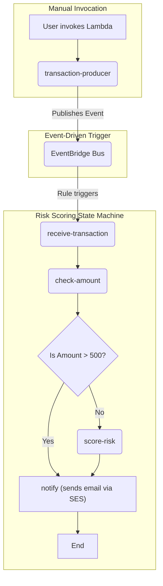

# Risk Scoring Workflow

This project demonstrates an event-driven, serverless risk-scoring workflow using AWS Step Functions to orchestrate multiple AWS Lambda functions. The workflow is triggered by an event published to an AWS EventBridge bus.

## Architecture Diagram



## Sequence Diagram

For a detailed sequence diagram of the risk scoring flow, see [diagrams/event-driven-sequence.mmd](../../../diagrams/event-driven-sequence.mmd).

## Prerequisites

*   [Terraform](https://learn.hashicorp.com/tutorials/terraform/install-cli) installed
*   [AWS CLI](https://docs.aws.amazon.com/cli/latest/userguide/cli-chap-install.html) installed and configured with your AWS credentials

## Deployment

1.  Initialize Terraform:

    ```bash
    terraform init
    ```

2.  Apply the Terraform configuration:

    ```bash
    terraform apply
    ```

    Enter `yes` when prompted to confirm the deployment.

    **Note on Email Verification:** The first time you run `terraform apply`, it will provision an Amazon SES (Simple Email Service) identity for `zwii.doan@gmail.com`. AWS will send a verification email to this address. You **must** click the link in this email to complete the verification process. The workflow will fail until this step is completed.

## Usage

1.  Invoke the `transaction-producer` Lambda to generate a random transaction and send it to EventBridge. This function does not require any input payload. The following commands invoke the function and then delete the response file.

    **For Linux/macOS:**
    ```bash
    aws lambda invoke --function-name transaction-producer --cli-binary-format raw-in-base64-out -
    ```

    **For Windows (PowerShell):**
    ```powershell
    aws lambda invoke --function-name transaction-producer --cli-binary-format raw-in-base64-out response.json; Remove-Item response.json
    ```

2.  The event will trigger the Step Functions workflow automatically.

3.  Check the logs of the Lambda functions and the execution history of the Step Functions state machine in the AWS CloudWatch console to verify that the workflow executed successfully.

## Cleanup

To destroy the resources created by this project, run the following command:

```bash
terraform destroy
```

Enter `yes` when prompted to confirm the deletion.
