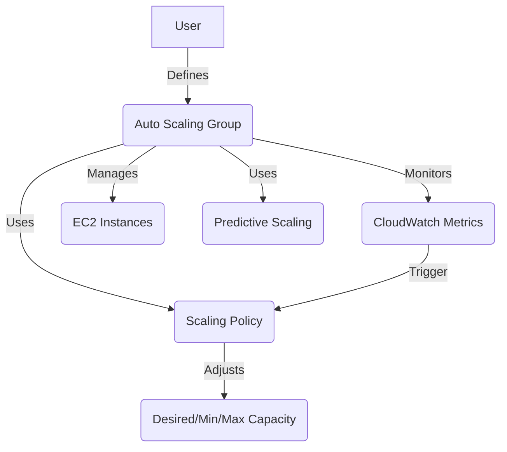

# AWS Auto Scaling Overview

## Table of Contents
- [Auto Scaling Concepts & Glossary](#auto-scaling-concepts--glossary)
- [When to Use Auto Scaling](#when-to-use-auto-scaling)
- [How Auto Scaling Works](#how-auto-scaling-works)
- [Scaling Policy Types](#scaling-policy-types)
- [Predictive Scaling](#predictive-scaling)
- [How Auto Scaling Components Work Together](#how-auto-scaling-components-work-together)
- [Practical Auto Scaling Example](#practical-auto-scaling-example)
- [Auto Scaling Best Practices](#auto-scaling-best-practices)
- [Further Reading](#further-reading)

---

## Auto Scaling Concepts & Glossary

| Term | Definition |
|------|------------|
| **Auto Scaling Group (ASG)** | A group of EC2 instances managed together for scaling and availability. |
| **Scaling Policy** | Rules that define when and how to scale the number of instances. |
| **Desired Capacity** | The target number of instances in the group. |
| **Minimum/Maximum Capacity** | The lower and upper limits for the number of instances. |
| **Scaling Activity** | An event where the group adds or removes instances. |
| **Predictive Scaling** | Uses historical data to forecast and automatically adjust capacity ahead of demand. |
| **CloudWatch Metrics** | Monitoring data (CPU, network, etc.) used to trigger scaling actions. |

---

## When to Use Auto Scaling

- **Variable Workloads:** Automatically adjust resources to match demand.
- **High Availability:** Replace unhealthy instances and maintain minimum capacity.
- **Cost Optimization:** Scale in to reduce costs during low demand.
- **Predictive Scaling:** Anticipate demand spikes and scale proactively.

---

## How Auto Scaling Works

1. **Define an Auto Scaling Group (ASG):** Specify instance details, network, and scaling boundaries.
2. **Set Scaling Policies:** Attach rules based on CloudWatch metrics (e.g., CPU > 70% triggers scale out).
3. **Monitor Metrics:** Auto Scaling continuously monitors CloudWatch metrics.
4. **Scaling Activities:** When a policy is triggered, Auto Scaling launches or terminates instances to maintain desired capacity.
5. **Health Checks:** Unhealthy instances are automatically replaced.

---

## Scaling Policy Types

Auto Scaling supports several policy types to automate scaling actions. Choosing the right policy or combination is key to building resilient, cost-optimised architectures.

- **Target-Tracking Scaling Policy:**  
  - Automatically adjusts capacity to keep a specific metric (like average CPU utilization or request count) at a target value.
  - Example: Maintain average CPU at 60%. If CPU rises above, scale out; if it drops, scale in.
  - Simple to configure and adapts to changing workloads.

- **Step/Metric Scaling Policy:**  
  - Scales based on CloudWatch alarms and defined steps.
  - Example: If CPU > 70% for 5 minutes, add 2 instances; if CPU < 30%, remove 1 instance.
  - Allows for more granular, rule-based scaling actions based on metric thresholds.

- **Predictive Scaling Policy:**  
  - Uses historical CloudWatch data to forecast future demand and scales in advance.
  - Example: Anticipates a daily traffic spike and adds capacity before it happens.
  - Reduces risk of under-provisioning and improves cost efficiency for recurring patterns.

**Summary:**  
Combining these policy types enables Auto Scaling to react to real-time changes, handle sudden spikes, and proactively prepare for predictable demand—forming the backbone of resilient, cost-optimised cloud designs.

---

## Predictive Scaling

- **Forecasting:** AWS analyses historical CloudWatch metrics (such as CPU, network, and custom metrics) to predict future demand.
- **Proactive Scaling:** Predictive Scaling automatically adjusts capacity ahead of forecasted demand spikes, not just in reaction to real-time metrics.
- **How it Works:**  
  - Collects and analyses up to 14 days of historical data.
  - Builds a forecast model to anticipate recurring patterns (e.g., daily or weekly traffic).
  - Adjusts the ASG’s desired capacity in advance, ensuring resources are ready before demand increases.
- **Benefits:**  
  - Reduces risk of under-provisioning during peak times.
  - Improves cost efficiency by scaling in when demand is low.

---

## How Auto Scaling Components Work Together

---

## Practical Auto Scaling Example

1. Create an ASG with min=2, max=10, desired=4.
2. Attach a scaling policy: add 2 instances if average CPU > 70% for 5 minutes.
3. Enable Predictive Scaling to forecast and prepare for daily traffic spikes.
4. ASG automatically adds/removes instances based on real-time and predicted demand.

---

## Auto Scaling Best Practices

- **Set Appropriate Min/Max/Desired Values:** Match your workload and budget.
- **Use Multiple Metrics:** Combine CPU, network, and custom metrics for smarter scaling.
- **Enable Health Checks:** Ensure failed instances are replaced automatically.
- **Leverage Predictive Scaling:** For workloads with recurring patterns.
- **Monitor and Adjust:** Regularly review scaling activity and adjust policies as needed.

---

## 2025 Enhancements

- **New `IncludeInstances=false` Filter on `DescribeAutoScalingGroups`:**
  - In 2025, AWS introduced the `IncludeInstances=false` filter for the `DescribeAutoScalingGroups` API.
  - **What it does:** When set, this filter allows you to retrieve Auto Scaling Group metadata without returning the full list of instance details.
  - **Benefits:**
    - **Performance:** Reduces API response size and latency, especially for large ASGs.
    - **Cost Efficiency:** Lowers data transfer and processing overhead for monitoring and automation tools.
    - **Simplicity:** Makes it easier to quickly audit or list ASGs without unnecessary instance data.

---

## Further Reading

- [How Auto Scaling Works](https://docs.aws.amazon.com/autoscaling/ec2/userguide/how-asg-works.html)
- [Predictive Scaling for EC2 Auto Scaling](https://docs.aws.amazon.com/autoscaling/ec2/userguide/ec2-auto-scaling-predictive-scaling.html)
- [Auto Scaling Best Practices](https://docs.aws.amazon.com/autoscaling/ec2/userguide/as-best-practices.html)
