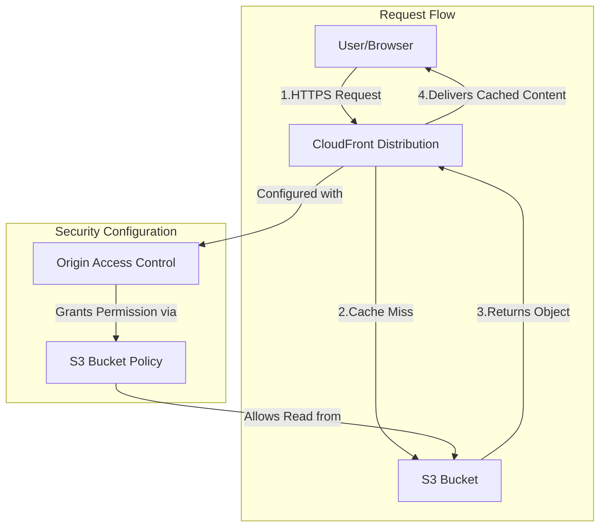

# Amazon CloudFront Overview

## Table of Contents
- [How CloudFront Works](#how-cloudfront-works)
- [Securely Integrating with Amazon S3](#securely-integrating-with-amazon-s3)
- [Key Concepts](#key-concepts)
- [Further Reading](#further-reading)

---

## How CloudFront Works

### S3 and CloudFront Integration Diagram

Amazon CloudFront is a global content delivery network (CDN) that delivers data, videos, applications, and APIs to customers globally with low latency and high transfer speeds.

1.  **Edge Locations**: CloudFront has a worldwide network of data centers called edge locations. When a user requests content, they are routed to the edge location that provides the lowest latency.
2.  **Edge Caching (CDN)**: CloudFront caches content at edge locations close to users, reducing latency and offloading requests from the origin. Cached content is served until it expires (TTL) or is invalidated.
3.  **TTL and Cache-Control Headers**: The Time to Live (TTL) determines how long CloudFront keeps content in its cache before fetching it again from the origin. TTL can be set globally or per object using cache behaviors and `Cache-Control` headers from the origin (e.g., S3). Examples:
    - `Cache-Control: max-age=3600` (cache for 1 hour)
    - `Cache-Control: no-cache` (always revalidate with origin)
    - `Cache-Control: must-revalidate` (must check with origin before serving stale content)
4.  **Invalidations and Origin Fetches**: To remove content from the cache before the TTL expires (e.g., after an update), you can create an invalidation. This forces CloudFront to get the latest version from the origin the next time the content is requested. When content is not cached, expired, or invalidated, CloudFront fetches the latest version from the origin and updates the cache.
5.  **Caching Headers**: CloudFront uses headers like `Cache-Control`, `ETag`, and `Last-Modified` for cache validation and conditional requests. If the object hasn't changed, CloudFront can serve cached content. These headers allow fine-grained control over caching behavior:
    - `ETag`: Unique identifier for object version. Used for cache validation.
    - `Last-Modified`: Timestamp of last update. Used for conditional requests.
    - `must-revalidate`: Ensures CloudFront checks with origin before serving stale content.

---

## Securely Integrating with Amazon S3

To ensure that users can only access your S3 content through CloudFront and not directly from the S3 bucket URL, you can use the following methods:

| Method | Description |
| --- | --- |
| **Origin Access Control (OAC)** | **(Recommended)** Modern, flexible, and more secure. Allows CloudFront to sign requests to S3 using SigV4, supports granular permissions, and works with both public and private S3 buckets. |
| **Origin Access Identity (OAI)** | (Legacy) Associates a special CloudFront user with your distribution. Grants S3 read permissions to this user, but does not support SigV4 signing or fine-grained control. |
| **Signed URLs and Signed Cookies** | Provide temporary, secure access to your private content. Use signed URLs for individual files and signed cookies for multiple files. |

### OAI vs OAC: Security, Signing, and Control

| Feature | OAI (Legacy) | OAC (Recommended) |
|---------|--------------|-------------------|
| **Request Signing** | No (uses basic identity) | Yes (SigV4 signing) |
| **Granular S3 Permissions** | Bucket-level only | Bucket & object-level, supports advanced conditions |
| **Header Forwarding** | Limited | Full support (can forward custom headers) |
| **Multiple Origins** | One OAI per distribution | One OAC per origin (more flexible) |
| **Works with S3 Access Points** | No | Yes |
| **AWS Recommendation** | Deprecated for new use | Best practice |

**Summary:**
- **OAC** is the modern, secure, and flexible way to restrict S3 access to CloudFront. It uses SigV4 signing, supports advanced S3 policies, and is required for new features.
- **OAI** is legacy, less secure, and not recommended for new deployments.

### Security Considerations
- Use OAC to prevent users from bypassing CloudFront and accessing S3 directly.
- Set restrictive bucket policies to allow only CloudFront access.
- Use signed URLs/cookies for private content.
- Monitor and audit access logs for suspicious activity.

---

## Key Concepts

| Term | Definition |
| --- | --- |
| **Distribution** | A CloudFront configuration that defines how content is delivered. It includes settings for origins, cache behaviors, and security. |
| **Origin** | The location where your original content is stored, such as an S3 bucket, an EC2 instance, or an on-premises server. |
| **Edge Location** | A data center where CloudFront caches copies of your content to be closer to your users. |
| **Cache Behavior** | A set of rules that determines how CloudFront handles requests for a specific URL pattern, including TTL settings and whether to forward headers and cookies. |
| **Cache-Control Header** | HTTP header from the origin that instructs CloudFront and browsers how to cache content. |
| **ETag** | Unique identifier for object version, used for cache validation. |
| **Last-Modified** | Timestamp of last update, used for cache validation. |

---

## Caching Headers with CloudFront

- **Cache-Control:** Directs how CloudFront and browsers cache content. Use `max-age`, `no-cache`, `must-revalidate` for fine-grained control.
- **ETag:** Unique identifier for object version. CloudFront uses ETag for cache validation and conditional requests.
- **Last-Modified:** Timestamp of last update. Used for conditional requests and cache validation.
- **Best Practices:**
    - Set appropriate `Cache-Control` headers on your origin (S3, web server) to control caching behavior.
    - Use `max-age` for static assets, `no-cache` for frequently changing content.
    - Use invalidations after updates to ensure users get the latest content.
    - Monitor cache hit ratios and adjust TTLs for optimal performance and cost.

---

## Further Reading

- [What is Amazon CloudFront?](https://docs.aws.amazon.com/AmazonCloudFront/latest/DeveloperGuide/Introduction.html)
- [Restricting access to an Amazon S3 origin](https://docs.aws.amazon.com/AmazonCloudFront/latest/DeveloperGuide/private-content-restricting-access-to-s3.html)
