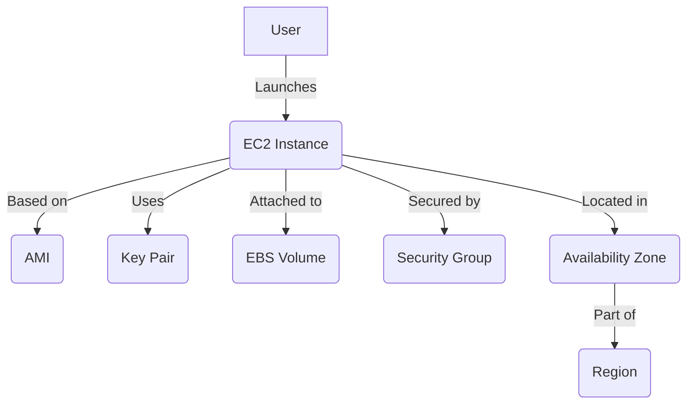

# AWS EC2 Overview

## Table of Contents
- [EC2 Concepts & Glossary](#ec2-concepts--glossary)
- [When to Use EC2](#when-to-use-ec2)
- [EC2 Instance Lifecycle](#ec2-instance-lifecycle)
- [How EC2 Components Work Together](#how-ec2-components-work-together)
- [Practical EC2 Example](#practical-ec2-example)
- [EC2 Best Practices](#ec2-best-practices)
- [Further Reading](#further-reading)
- [EC2 Launch Templates Deep Dive](#ec2-launch-templates-deep-dive)

---

## EC2 Concepts & Glossary

| Term | Definition |
|------|------------|
| **EC2 Instance** | A virtual server in AWS for running applications. |
| **AMI** | Amazon Machine Image; a template for the root volume of the instance. |
| **Instance Type** | Defines the hardware (CPU, memory, storage) for the instance. |
| **Instance Family** | A group of instance types optimized for specific workloads (e.g., compute, memory, storage, or GPU). |
| **vCPU / Memory** | The number of virtual CPUs and amount of RAM; key factors for performance and cost. |
| **Network Performance** | The bandwidth and throughput available to the instance; varies by type and size. |
| **Key Pair** | Used for secure SSH access to Linux instances or password retrieval for Windows. |
| **Security Group** | Virtual firewall controlling inbound and outbound traffic. |
| **Elastic IP** | Static, public IPv4 address for dynamic cloud computing. |
| **EBS Volume** | Elastic Block Store; persistent block storage for EC2. |
| **Instance Store** | Temporary, physically attached storage that is lost when the instance stops or terminates. |
| **Region** | Geographical area hosting AWS resources. |
| **Availability Zone** | Isolated location within a region. |

---

**Right-Sizing & Cost Modelling:**  
Choosing the correct instance family, size (vCPU/memory), network performance, and storage type (EBS vs instance store) is essential for balancing performance and cost. Right-sizing ensures you don’t overpay for unused resources or under-provision for your workload.

---

## When to Use EC2

- **Scalable Compute:** Run scalable virtual servers for web apps, batch jobs, or backend systems.
- **Custom Environments:** Deploy custom OS, software, and configurations.
- **Temporary or Persistent Workloads:** For both short-term and long-running workloads.
- **Elasticity:** Scale up or down based on demand.

---

## EC2 Instance Lifecycle

1. **Launch:** Choose AMI, instance type, configure settings, and launch.
2. **Running:** Instance is active and accessible.
3. **Stop/Start:** You can stop (save state) and start (resume) instances.
4. **Reboot:** Restart the instance without changing its state.
5. **Terminate:** Permanently delete the instance.

---

## How EC2 Components Work Together

---

## Practical EC2 Example

**Launching a Basic EC2 Instance:**
1. Select an AMI (e.g., Amazon Linux 2).
2. Choose an instance type (e.g., t2.micro).
3. Configure instance details (network, IAM role, etc.).
4. Add storage (EBS volume).
5. Configure security group (allow SSH/HTTP).
6. Launch and connect using a key pair.

---

## EC2 Best Practices

- **Use Security Groups:** Restrict access to only necessary ports.
- **Use Key Pairs Securely:** Never share or lose your private key.
- **Monitor Usage:** Use CloudWatch for monitoring and alerts.
- **Automate with Tags:** Tag resources for management and automation.
- **Backup Data:** Regularly snapshot EBS volumes.