# Summary Note: ECS vs. EKS

This note provides a high-level comparison between AWS ECS and AWS EKS, helping solution architects choose the right container orchestration service for their workloads.

## Overview

Both ECS and EKS are powerful container orchestration services, but they serve different needs and levels of operational complexity.

- **Amazon ECS (Elastic Container Service):** A highly scalable, high-performance container orchestration service. It can be used in two modes:
    - **Fargate:** A fully serverless container engine where AWS manages the underlying infrastructure. It's designed for simplicity and speed.
    - **EC2:** You manage the EC2 instances (worker nodes) that your containers run on, offering more control over the environment.
- **Amazon EKS (Elastic Kubernetes Service):** A managed Kubernetes service that provides the flexibility and power of open-source Kubernetes with the reliability of AWS.

## Key Differences & Trade-Offs

| Criteria | ECS Fargate | EKS |
| :--- | :--- | :--- |
| **Setup Time** | Fast (no cluster to manage) | Slower (requires cluster creation/setup) |
| **Complexity** | Low (abstracts away infrastructure) | High (requires Kubernetes expertise) |
| **Use Cases** | Microservices, REST APIs, batch jobs | Complex/stateful apps, custom networking |
| **Autoscaling** | Task-level, integrated with CloudWatch | Pod-level (HPA), Cluster Autoscaler |
| **Networking** | Simpler (ENI per task) | More flexible but complex (CNI plugins) |
| **Costs** | Pay-per-task (vCPU/memory per second) | Pay for control plane + worker nodes |
| **GPU Support** | Not available | Supported via Managed Node Groups |
*Note: While Fargate does not support GPUs, **ECS on EC2** does, making it a viable option for GPU workloads.*

## Visual Comparison

```mermaid
graph TD
    subgraph AWS Container Orchestration
        A[ECS]
        B[EKS]
    end

    subgraph "ECS Characteristics"
        direction LR
        A1("🚀 Fast Deployment (Fargate)")
        A2("🧘 Low Complexity (Fargate)")
        A3("🔧 Control (EC2 Mode)")
        A4("💸 Pay-per-Task (Fargate)")
    end

    subgraph "EKS Characteristics"
        direction LR
        B1("🔧 High Control")
        B2("🧩 Kubernetes Ecosystem")
        B3("👷‍♀️ Customer-Managed Nodes")
        B4("🌐 Complex Networking")
    end

    A --> A1 & A2 & A3 & A4
    B --> B1 & B2 & B3 & B4

    style A fill:#FF9900,stroke:#333,stroke-width:2px
    style B fill:#232F3E,stroke:#FF9900,stroke-width:2px,color:#fff
```

## Specialized Workloads (e.g., GPU)

When your application requires specialized hardware like GPUs for machine learning or high-performance computing, the choice of compute platform is critical.

-   **EKS:** Natively supports GPU instances through its managed node groups. You can create node groups with GPU-enabled instance types (e.g., P3, G4dn), and Kubernetes will schedule pods to these nodes.
-   **ECS on EC2:** While **Fargate does not support GPUs**, you can use **ECS on EC2**. This involves creating an ECS cluster with a launch configuration or launch template that specifies GPU-optimized AMIs and instance types. ECS can then place tasks on these instances. This provides GPU capabilities without the full complexity of EKS.

## Security Considerations

- **ECS:** Security is simplified through **IAM Roles for Tasks**. Each task can have a specific IAM role, isolating permissions at the container level. This applies to both Fargate and EC2 launch types.
- **EKS:** Offers more granular control via **IAM Roles for Service Accounts (IRSA)**. This maps IAM roles to Kubernetes service accounts, allowing fine-grained access control for pods but adding configuration complexity.

## When to Choose Which?

- **Choose ECS Fargate when:**
  - You prioritize speed of deployment and operational simplicity.
  - Your workloads are stateless or simple batch jobs.
  - Your team has limited Kubernetes experience.

- **Choose ECS on EC2 when:**
    - You need more control over the underlying instances (e.g., for specific compliance or networking).
    - You need to use **GPU-powered instances** but want a simpler orchestration experience than EKS.

- **Choose EKS when:**
  - You need the full power and flexibility of the Kubernetes ecosystem.
  - You are running complex, stateful applications or require specific networking configurations.
  - Your organization is standardized on Kubernetes or planning a multi-cloud strategy.
