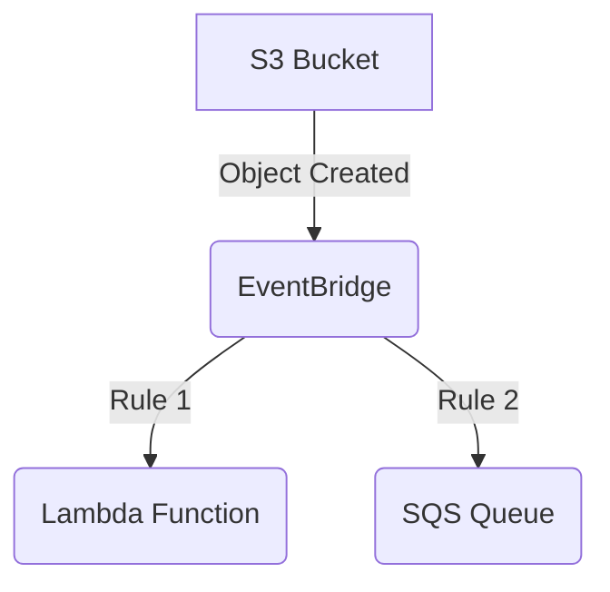
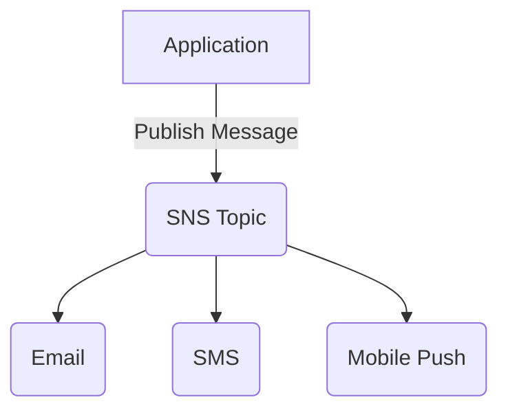
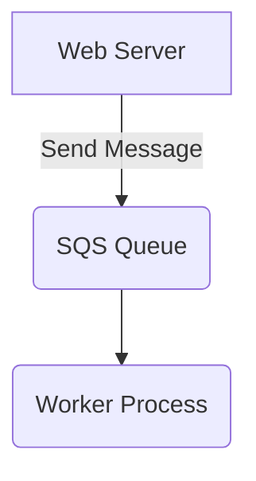

# Event-Driven Architecture on AWS: EventBridge vs. SNS vs. SQS

In modern cloud architectures, event-driven design is a powerful paradigm for building decoupled, scalable, and resilient systems. AWS provides several services that facilitate event-driven communication, with Amazon EventBridge, Amazon Simple Notification Service (SNS), and Amazon Simple Queue Service (SQS) being the most prominent. This document aims to compare these services, outline their best use cases, and provide best practices for their implementation.

## Core Concepts

Before diving into the comparison, let's briefly define the core concepts:

*   **Event:** A significant change in state. For example, a new user signing up, an order being placed, or a file being uploaded to an S3 bucket.
*   **Event Source:** The service or application that generates an event.
*   **Event Consumer:** The service or application that receives and processes an event.
*   **Event Bus:** A central hub that receives events from various sources and routes them to the appropriate consumers.
*   **Topic:** A communication channel to which messages are sent. Subscribers to the topic receive all messages published to it.
*   **Queue:** A temporary repository for messages that are awaiting processing.

## Comparison of Services

| Feature                | Amazon EventBridge                                                              | Amazon SNS                                                                    | Amazon SQS                                                                    |
| ---------------------- | ------------------------------------------------------------------------------- | ----------------------------------------------------------------------------- | ----------------------------------------------------------------------------- |
| **Primary Use Case**   | Building event-driven applications with complex routing and filtering.          | Fan-out notifications to multiple subscribers (e.g., email, SMS, mobile push). | Decoupling microservices and ensuring reliable message processing.            |
| **Event Structure**    | JSON objects with a defined schema.                                             | Plain text or JSON messages.                                                  | Plain text or JSON messages.                                                  |
| **Filtering**          | Advanced filtering based on event content, source, and other attributes.        | Basic filtering based on message attributes.                                  | No built-in filtering. Consumers must process all messages in the queue.      |
| **Routing**            | Rule-based routing to multiple targets, including Lambda, SQS, and more.        | Pub/sub model where messages are broadcast to all subscribers of a topic.     | Point-to-point communication where a message is consumed by a single consumer. |
| **Integration**        | Native integration with over 200 AWS services and third-party SaaS applications. | Integrates with various AWS services and can send notifications via multiple protocols. | Integrates with many AWS services, particularly for asynchronous processing.    |
| **Scalability**        | Highly scalable and can handle a large volume of events.                        | Highly scalable and can deliver messages to millions of subscribers.          | Highly scalable and can handle a high throughput of messages.                 |
| **Reliability**        | At-least-once delivery with retries and dead-letter queues (DLQs).              | At-least-once delivery with retries and DLQs.                                 | At-least-once delivery with DLQs and visibility timeouts.                       |
| **Ordering**           | No guaranteed order of delivery.                                                | No guaranteed order of delivery.                                              | FIFO (First-In, First-Out) queues provide ordered message processing.         |
| **Cost**               | Pay-per-event model.                                                            | Pay-per-notification model.                                                   | Pay-per-request model.                                                        |

## When to Use Which Service

### Amazon EventBridge

Use EventBridge when you need to build a sophisticated event-driven architecture with complex routing and filtering requirements. It's ideal for:

*   **Decoupling microservices:** EventBridge allows services to communicate asynchronously without being tightly coupled.
*   **Integrating with third-party applications:** EventBridge can receive events from SaaS applications and route them to your AWS services.
*   **Building event-driven workflows:** You can create rules that trigger different actions based on the content of an event.

**Example:**

### Amazon SNS

Use SNS when you need to send notifications to a large number of subscribers. It's ideal for:

*   **Sending push notifications to mobile devices.**
*   **Sending email or SMS alerts.**
*   **Broadcasting messages to multiple services.**

**Example:**

### Amazon SQS

Use SQS when you need to decouple microservices and ensure reliable message processing. It's ideal for:

*   **Buffering requests to a backend service.**
*   **Processing tasks asynchronously.**
*   **Ensuring that messages are processed in order (with FIFO queues).**

**Example:**

## When to Prefer EventBridge over SNS/SQS

While SNS and SQS are fundamental building blocks for event-driven architectures, EventBridge offers distinct advantages that make it the preferred choice in several scenarios:

*   **Complex Event Routing and Filtering:** EventBridge excels when you need to route events to different targets based on sophisticated rules and content-based filtering. Unlike SNS (which has basic attribute filtering) or SQS (no built-in filtering), EventBridge allows you to define intricate patterns to match specific events and send them to one or more destinations. This is crucial for microservices architectures where different services might be interested in different aspects of an event.

*   **Integration with SaaS Applications and AWS Services:** EventBridge has native integrations with over 200 AWS services and a growing number of third-party SaaS applications (e.g., Salesforce, Zendesk, Shopify). This makes it a central hub for events originating from various sources, both within and outside AWS. If your architecture involves consuming events from SaaS providers or a wide array of AWS services, EventBridge simplifies the ingestion and routing process significantly.

*   **Schema Registry and Event Discovery:** EventBridge includes a Schema Registry that automatically discovers and stores event schemas. This is invaluable for maintaining event consistency, validating events, and enabling consumers to understand the structure of events they receive. This feature is not available with SNS or SQS, where schema management is a manual process.

*   **Decoupling Event Producers from Consumers:** EventBridge provides a higher level of decoupling. Producers publish events to the event bus without needing to know which consumers are interested or how many there are. Consumers, in turn, subscribe to events based on rules, without needing to know the producers. This loose coupling promotes agility and independent evolution of services.

*   **Centralized Event Bus for the Organization:** For larger organizations, EventBridge can serve as a central event bus, allowing different teams and applications to publish and subscribe to events across the organization. This fosters a common eventing strategy and simplifies cross-team communication.

*   **Event Replay:** EventBridge allows you to archive events and replay them later. This is a powerful feature for debugging, testing new features, or recovering from errors, as you can re-process past events without requiring the original source to re-emit them. This capability is not inherent in SNS or SQS.

In summary, while SNS is excellent for simple fan-out messaging and SQS for reliable point-to-point or FIFO messaging, **EventBridge is the go-to service for building robust, scalable, and highly decoupled event-driven architectures that involve complex routing, diverse event sources (especially SaaS), and advanced event management features like schema discovery and event replay.**

## Best Practices

*   **Use EventBridge for complex event routing and filtering.**
*   **Use SNS for fan-out notifications.**
*   **Use SQS for decoupling microservices and reliable message processing.**
*   **Use DLQs to handle failed events.**
*   **Use IAM policies to secure your resources.**
*   **Monitor your services using CloudWatch.**

## References

*   [AWS Documentation: Comparing SNS, SQS, and EventBridge](https://docs.aws.amazon.com/eventbridge/latest/userguide/eb-sqs-sns.html)
*   [AWS Documentation: Amazon SNS](https://docs.aws.amazon.com/sns/latest/dg/welcome.html)
*   [AWS Documentation: Amazon SQS](https://docs.amazon.com/AWSSimpleQueueService/latest/SQSDeveloperGuide/welcome.html)