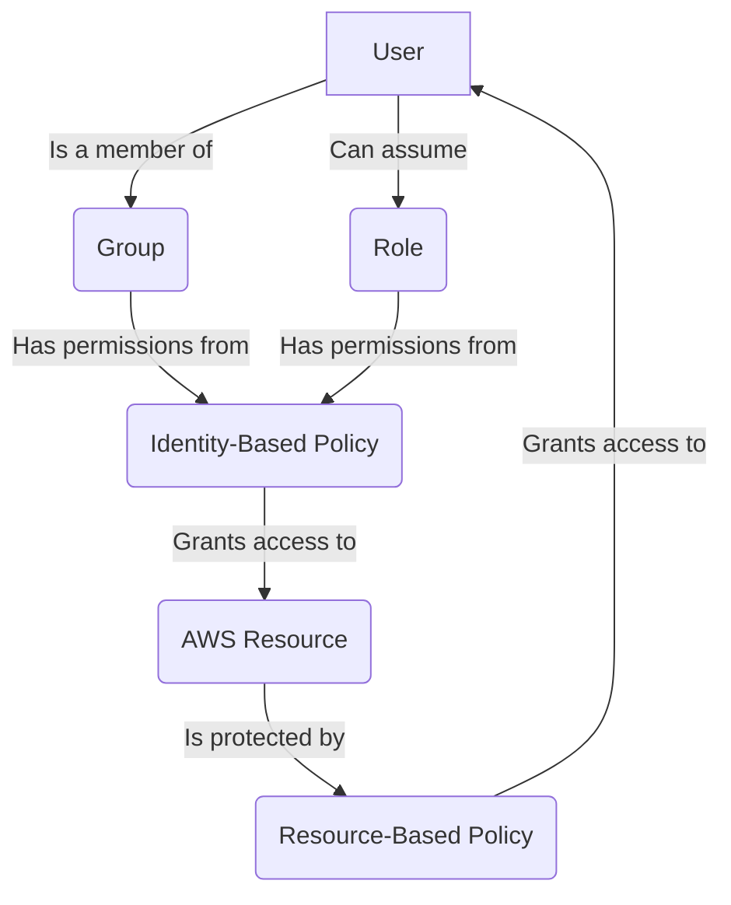

# AWS IAM Overview

## Table of Contents
- [IAM Concepts & Glossary](#iam-concepts--glossary)
- [When to Use IAM](#when-to-use-iam)
- [IAM Policies](#iam-policies)
- [Trust Relationships](#trust-relationships)
- [How IAM Components Work Together](#how-iam-components-work-together)
- [Practical Policy Examples](#practical-policy-examples)
- [IAM Best Practices](#iam-best-practices)
- [Further Reading](#further-reading)

---

## IAM Concepts & Glossary

| Term | Definition |
|------|------------|
| **User** | An identity for a person or application with long-term credentials. |
| **Group** | A collection of IAM users for permission management. |
| **Role** | An identity with temporary permissions that can be assumed by users or AWS services. |
| **Policy** | A JSON document that defines permissions (allowed/denied actions on resources). |
| **Permissions Policy** | A policy (identity-based or resource-based) that defines what actions are allowed or denied on which resources. |
| **Identity-Based Policy** | Attached to a user, group, or role; specifies what the identity can do. |
| **Resource-Based Policy** | Attached to a resource; specifies who can access the resource and what actions they can perform. |
| **Managed Policy** | Standalone policy you can attach to multiple identities. |
| **Inline Policy** | Policy embedded in a single user, group, or role. |
| **MFA** | Multi-Factor Authentication for extra security. |
| **Trust Policy** | A policy attached to a role that defines who (which principals) can assume the role. |

---

## When to Use IAM

- **Fine-Grained Access Control:** To specify exactly which resources users can access and what they can do with them.
- **Multi-Factor Authentication (MFA):** To add an extra layer of security for your account and its resources.
- **Temporary Access:** To grant short-term access to resources using IAM Roles.
- **Permissions for Services:** To allow AWS services (like EC2 instances) to access other AWS services (like S3 buckets).

---

## IAM Policies

IAM policies are the foundation of permissions in AWS. They define what actions are allowed or denied on which AWS resources.

### Policy Types

- **Permissions Policies:** These are policies that define what actions are allowed or denied on which resources. They can be identity-based (attached to users, groups, or roles) or resource-based (attached to resources like S3 buckets or SQS queues).
- **Identity-Based Policies:** Attached to an IAM user, group, or role. These policies let you specify what that identity can do (its permissions).
- **Resource-Based Policies:** Attached to a resource. These policies specify who has permission to access the resource and what actions they can perform on it.
- **Trust Policies:** Attached to a role. These policies define which principals (users, roles, services, or accounts) are allowed to assume the role. Trust policies are required for cross-account access, federated access, and service roles.

### Policy Management

- **Managed Policies:** Standalone policies that you can attach to multiple users, groups, and roles. AWS provides managed policies, or you can create your own.
- **Inline Policies:** Policies that are embedded in a single user, group, or role. These policies are useful for applying permissions that should not be shared with other identities.

---

## Trust Relationships

A trust relationship is defined by a trust policy attached to an IAM role. It specifies which principals (users, roles, AWS services, or accounts) are allowed to assume the role. Trust relationships are essential for delegation, cross-account access, and federated identity scenarios.

**Example Trust Policy (Allow EC2 to Assume a Role):**

```json
{
  "Version": "2012-10-17",
  "Statement": [
    {
      "Effect": "Allow",
      "Principal": { "Service": "ec2.amazonaws.com" },
      "Action": "sts:AssumeRole"
    }
  ]
}
```

**Example Trust Policy (Allow Another AWS Account to Assume a Role):**

```json
{
  "Version": "2012-10-17",
  "Statement": [
    {
      "Effect": "Allow",
      "Principal": { "AWS": "arn:aws:iam::123456789012:root" },
      "Action": "sts:AssumeRole"
    }
  ]
}
```

---

## How IAM Components Work Together



---

## Practical Policy Examples

### Example 1: Simple S3 Read Access (Identity-Based)

```json
{
  "Version": "2012-10-17",
  "Statement": [
    {
      "Effect": "Allow",
      "Action": "s3:ListBucket",
      "Resource": "arn:aws:s3:::example-bucket"
    }
  ]
}
```

### Example 2: S3 Bucket Policy (Resource-Based)

```json
{
  "Version": "2012-10-17",
  "Statement": [
    {
      "Effect": "Allow",
      "Principal": { "AWS": "arn:aws:iam::123456789012:root" },
      "Action": "s3:PutObject",
      "Resource": "arn:aws:s3:::example-bucket/*"
    }
  ]
}
```

---

## IAM Best Practices

- **Principle of Least Privilege:** Grant only the minimum permissions required.
- **Use Roles for Applications:** Prefer IAM roles for applications on EC2 or Lambda.
- **Enable MFA:** Secure privileged users with Multi-Factor Authentication.
- **Use Groups for Users:** Assign permissions to groups, not individual users.
- **Regularly Review Permissions:** Periodically audit and remove unused access.

---

## Further Reading

- [AWS IAM User Guide](https://docs.aws.amazon.com/IAM/latest/UserGuide/introduction.html)
- [IAM Best Practices](https://docs.aws.amazon.com/IAM/latest/UserGuide/best-practices.html)
- [Policies and Permissions in IAM](https://docs.aws.amazon.com/IAM/latest/UserGuide/access_policies.html)
- [IAM Trust Policies](https://docs.aws.amazon.com/IAM/latest/UserGuide/id_roles_manage_modify.html#roles-modify_trust-policy)