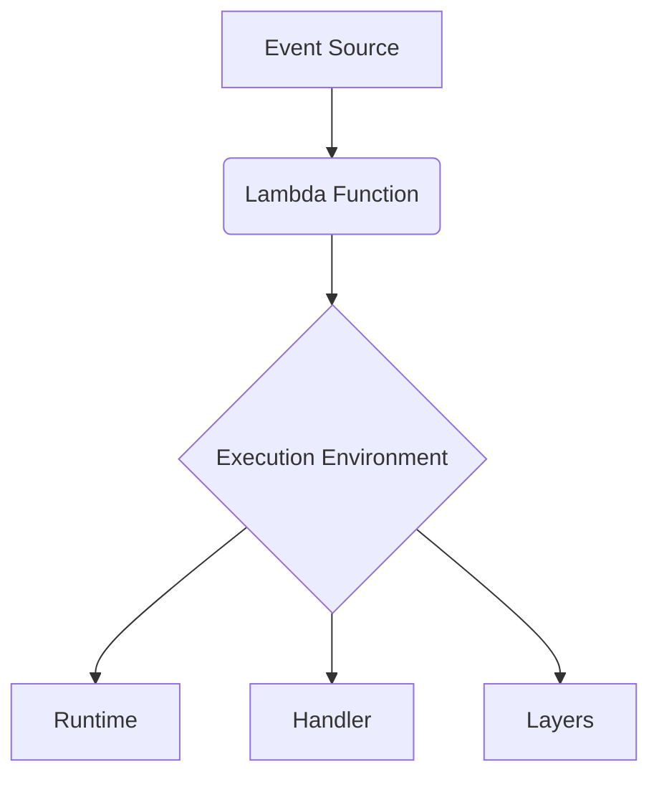
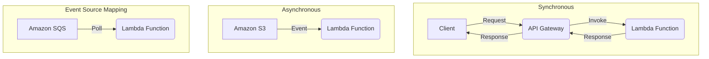

# AWS Lambda Overview

AWS Lambda is a serverless compute service that lets you run code without provisioning or managing servers. It automatically scales your application by running code in response to triggers and you only pay for the compute time you consume.

## Core Concepts

*   **Function**: A script or application that runs in Lambda. It processes events and can be written in various languages supported by Lambda runtimes.
*   **Runtime**: A language-specific environment that runs your function. Lambda provides runtimes for popular languages like Node.js, Python, Java, and more. You can also create your own custom runtime.
*   **Event**: A JSON document that contains data for your Lambda function to process. Events trigger the function and pass data to it.
*   **Execution Environment**: A secure and isolated environment where your Lambda function runs. It manages the resources needed to run your function and provides lifecycle support.
*   **Handler**: The method in your function code that processes events. It's the entry point for your Lambda function.
*   **Layers**: A way to package libraries and other dependencies that you can share across multiple Lambda functions. This helps to reduce the size of your deployment package.



## Pricing Model

AWS Lambda pricing is based on the following components:

*   **Number of Requests**: You are charged for the total number of requests for your functions. There is a perpetual free tier of 1 million requests per month.
*   **Duration**: This is the time your code takes to execute, measured in milliseconds. The cost depends on the amount of memory you allocate to your function. The free tier includes 400,000 GB-seconds of compute time per month.
*   **Ephemeral Storage**: Each function includes 512MB of ephemeral storage at no cost. You can configure additional storage up to 10,240 MB and pay for the configured amount.
*   **Data Transfer**: You are charged for data transferred in and out of your Lambda functions from outside the region where the function executed.

## Invocation Types

There are three main ways a Lambda function can be invoked:

1.  **Synchronous (Request-Response)**: This is a push-based model where the caller waits for the function to complete and return a response. It's the most direct invocation method and is suitable for tasks like handling API requests from Amazon API Gateway or user-facing workflows.
2.  **Asynchronous (Event)**: In this model, Lambda queues the event for processing and returns a success response to the caller immediately. This is ideal for tasks that don't require an immediate response, such as processing S3 bucket events or SNS notifications.
3.  **Event Source Mapping (Poll-based)**: In this model, Lambda polls an event source, such as an Amazon SQS queue, a DynamoDB stream, or a Kinesis stream, and invokes your function with a batch of events. This is suitable for processing data from streams and queues.



## When to Use Lambda

*   **Web Applications**: Build serverless backends for your web applications.
*   **Real-time Data Processing**: Process data from sources like Kinesis streams and DynamoDB streams.
*   **Event-driven Architectures**: Build applications that respond to events from various AWS services.
*   **Automation**: Automate tasks like backups, reporting, and monitoring.

## Best Practices

### Function Code

*   **Separate your business logic from the handler.** This is a critical best practice that improves testability, reusability, and maintainability. The handler should be a thin layer that delegates to your core logic.

    **Example:** See the detailed three-layer example below.

*   **Take advantage of execution environment reuse to improve performance.** Initialize SDK clients and database connections outside of your function handler. This allows them to be reused across multiple invocations, reducing latency and improving efficiency.

    **Example:**

    ```python
    # lib/database.py
    import pymysql
    import os

    # Initialize the connection outside the handler
    # This code runs during a cold start
    db_connection = pymysql.connect(
        host=os.environ['DB_HOST'],
        user=os.environ['DB_USER'],
        password=os.environ['DB_PASSWORD'],
        database=os.environ['DB_NAME']
    )

    def get_user(user_id):
        # This function reuses the existing db_connection
        with db_connection.cursor() as cursor:
            cursor.execute("SELECT * FROM users WHERE id = %s", (user_id,))
            return cursor.fetchone()
    ```
    In your handler, you would then import and use `get_user` without re-establishing the connection on every invocation.

*   **Use environment variables for operational parameters instead of hard-coding them.** This makes your code more flexible and secure. You can change configurations without deploying new code.

    **Example:**

    In your `template.yaml` or Terraform file:
    ```yaml
    MyFunction:
      Type: AWS::Serverless::Function
      Properties:
        Handler: app.lambda_handler
        Runtime: python3.9
        Environment:
          Variables:
            TABLE_NAME: MyUserTable
            LOG_LEVEL: INFO
    ```

    In your Python code:
    ```python
    import os
    import logging

    # Get configuration from environment variables
    table_name = os.environ.get('TABLE_NAME', 'default_table')
    log_level = os.environ.get('LOG_LEVEL', 'WARNING').upper()

    logger = logging.getLogger()
    logger.setLevel(log_level)

    def lambda_handler(event, context):
        logger.info(f"Accessing table: {table_name}")
        # ... function logic ...
    ```

### Function Configuration

*   **Configure the optimal memory for your function.** Memory allocation in Lambda also determines the amount of CPU your function gets. Use tools like AWS Lambda Power Tuning to find the most cost-effective memory setting for your specific workload. A function might run faster and cheaper with more memory.
*   **Set appropriate timeouts.** Configure the timeout to be slightly higher than the expected maximum execution time. This prevents your function from running indefinitely and incurring unnecessary costs, while also providing a buffer for unexpected delays.

### Deployment

*   **Minimize the size of your deployment package.** A smaller package size reduces the time it takes for your function to download and start up (cold start).
    *   Only include the libraries your function needs.
    *   Use tools like `serverless-python-requirements` or the `slim` option in the SAM CLI to package only the necessary dependencies.
*   **Use Lambda Layers to share common dependencies.** If you have multiple functions that use the same libraries (e.g., `pandas`, `requests`), package them into a Lambda Layer. This reduces the size of each individual function's deployment package and simplifies dependency management.

### Security

*   **Use the most restrictive IAM permissions (Principle of Least Privilege).** Your function's execution role should only have the permissions it absolutely needs to perform its task.

    **Bad Example (Overly Permissive):**
    ```json
    {
        "Version": "2012-10-17",
        "Statement": [
            {
                "Effect": "Allow",
                "Action": "dynamodb:*",
                "Resource": "*"
            }
        ]
    }
    ```

    **Good Example (Least Privilege):**
    ```json
    {
        "Version": "2012-10-17",
        "Statement": [
            {
                "Effect": "Allow",
                "Action": "dynamodb:GetItem",
                "Resource": "arn:aws:dynamodb:us-east-1:123456789012:table/MyUserTable"
            }
        ]
    }
    ```

*   **Use resource policies to control invocation.** A resource-based policy specifies which principals (accounts, users, services) are allowed to invoke your function. This is an additional layer of security on top of IAM roles.

### Scalability and Resilience

*   **Configure reserved concurrency.** This guarantees a certain number of concurrent executions for your function, ensuring it's always available for critical workloads. It also acts as a ceiling, preventing it from overwhelming downstream services (like a database).
*   **Implement retries with exponential backoff and jitter.** For asynchronous invocations, Lambda automatically retries twice. For synchronous calls or when interacting with other services, implement your own retry logic. Exponential backoff (waiting longer between retries) and jitter (adding randomness to the wait time) prevents thundering herd problems.
*   **Use Dead-Letter Queues (DLQs) for failed events.** For asynchronous invocations, if an event fails after all retry attempts, Lambda can send it to a DLQ (an SQS queue or SNS topic). This allows you to inspect the failed event later to diagnose the problem without losing the data.

### Example: Separating Logic with a Controller Layer

A robust way to structure your application is to use a three-layered approach: the handler, a controller (or adapter), and the core business logic. This provides maximum decoupling and testability.

**1. `handler.py` (The Entry Point)**
```python
# handler.py
from controller import handle_request

def lambda_handler(event, context):
    return handle_request(event)
```

**2. `controller.py` (The Adapter/Controller Layer)**
```python
# controller.py
from business_logic import create_greeting

def handle_request(event):
    try:
        name = event['queryStringParameters']['name']
        greeting_message = create_greeting(name)
        return {
            'statusCode': 200,
            'body': greeting_message
        }
    except KeyError:
        return {
            'statusCode': 400,
            'body': 'Missing "name" parameter in the request.'
        }
    except ValueError as e:
        return {
            'statusCode': 400,
            'body': str(e)
        }
    except Exception as e:
        print(f"An unexpected error occurred: {e}")
        return {
            'statusCode': 500,
            'body': 'Internal Server Error'
        }
```

**3. `business_logic.py` (The Core Logic)**
```python
# business_logic.py
def create_greeting(name: str) -> str:
    if not isinstance(name, str) or not name.strip():
        raise ValueError("Name must be a non-empty string.")
    return f"Hello, {name}!"
```

## Limits and Quotas

When deploying Lambda functions at production scale, it's crucial to be aware of the various limits and quotas imposed by AWS. These can be categorized as either **soft limits** (which can be increased upon request to AWS Support) or **hard limits** (which cannot be changed).

### Concurrency

*   **Default Account Limit:** By default, AWS Lambda provides a total concurrency limit of 1,000 concurrent executions across all functions in an AWS Region. This is a **soft limit** and can be increased upon request.
*   **Function-level Concurrency:** You can configure reserved concurrency for individual functions to ensure they always have a dedicated amount of concurrency, preventing other functions from consuming all available capacity.
*   **Provisioned Concurrency:** This keeps a specified number of function instances initialized and ready to respond instantly, significantly reducing cold start times for critical functions.

### Deployment Package Size

*   **Direct Upload (zipped):** The maximum size for a zipped deployment package uploaded directly to Lambda is 50 MB.
*   **Upload via S3 (zipped):** If you upload your code to an S3 bucket, the unzipped deployment package size (including layers) can be up to 250 MB.
*   **Lambda Layers:** You can use up to 5 layers per function. The total unzipped size of the function code and all layers combined cannot exceed 250 MB.
*   **Container Images:** For larger applications, Lambda supports deploying functions as container images, with a maximum image size of 10 GB.

### Payload Size

*   **Synchronous Invocations:** The maximum payload size for both request and response in synchronous invocations is 6 MB.
*   **Asynchronous Invocations:** The event request body for asynchronous invocations has a limit of 128 KB.

### Memory Allocation

*   Functions can be configured with memory ranging from 128 MB to 10,240 MB (10 GB), in 1 MB increments. Lambda allocates CPU power proportionally to the configured memory.

### Execution Timeout

*   The maximum execution time for a single Lambda function invocation is 15 minutes (900 seconds).

### Ephemeral Storage (`/tmp`)

*   Each Lambda function has a temporary file system (`/tmp`) with a default capacity of 512 MB, which can be increased up to 10 GB.

### Environment Variables

*   The total combined size of all environment variables for a Lambda function cannot exceed 4 KB. This is a **hard limit**.

### Function and Layer Storage

*   There is a storage limit of 75 GB per account per region for uploaded functions and layers. This is a **soft limit** and can be increased.

## References

*   [AWS Lambda Documentation](https://docs.aws.amazon.com/lambda/latest/dg/welcome.html)
*   [AWS Lambda Power Tuning](https://github.com/alexcasalboni/aws-lambda-power-tuning)
*   [AWS Lambda Quotas](https://docs.aws.amazon.com/lambda/latest/dg/limits.html)