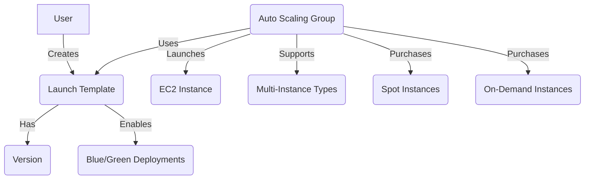

## EC2 Launch Templates Deep Dive

### Table of Contents
- [Launch Templates Concepts & Glossary](#launch-templates-concepts--glossary)
- [Why Use Launch Templates?](#why-use-launch-templates)
- [Consolidated Spot + On-Demand Purchasing](#consolidated-spot--on-demand-purchasing)
- [Launch Templates vs. Launch Configurations](#launch-templates-vs-launch-configurations)
- [Launch Template Versioning & Blue/Green Deployments](#launch-template-versioning--bluegreen-deployments)
- [How Launch Templates Work in Auto Scaling](#how-launch-templates-work-in-auto-scaling)
- [Best Practices](#best-practices)
- [Further Reading](#further-reading-1)

---

### Launch Templates Concepts & Glossary

| Term | Definition |
|------|------------|
| **Launch Template** | A reusable configuration for launching EC2 instances, including AMI, instance type, key pair, security groups, and more. |
| **Versioning** | Each update to a launch template creates a new version, enabling safe rollouts and rollbacks. |
| **Auto Scaling Group (ASG)** | A group of EC2 instances managed together for scaling and availability. |
| **Multi-Instance-Type ASG** | An ASG that can launch multiple instance types for flexibility and cost optimization. |
| **Spot Instances** | Spare AWS compute capacity at reduced cost, but can be interrupted. |
| **On-Demand Instances** | Standard pay-as-you-go EC2 instances. |

---

### Why Use Launch Templates?

- **Multi-Instance-Type ASGs:** Launch templates allow Auto Scaling Groups to use multiple instance types, improving flexibility, availability, and cost optimization.
- **Consistent, Reusable Configurations:** Templates ensure all instances are launched with consistent settings, reducing errors and simplifying management.

---

### Consolidated Spot + On-Demand Purchasing

Launch templates enable you to define both Spot and On-Demand purchasing options within a single Auto Scaling Group (ASG). This consolidated approach allows the ASG to automatically provision a mix of Spot and On-Demand instances according to your allocation strategy and requirements.

- **Cost Optimization:** Spot Instances are often much cheaper than On-Demand, so using a mix can significantly reduce costs.
- **Improved Availability:** If Spot capacity is unavailable or interrupted, the ASG can fall back to On-Demand instances to maintain desired capacity.
- **Simplified Management:** You don’t need separate configurations or ASGs for each purchase option; everything is managed together, making scaling and updates easier.
- **How it works:**  
  - You specify the percentage or number of instances to launch as Spot and On-Demand.
  - The ASG automatically balances the mix, replacing interrupted Spot Instances with On-Demand if needed, or vice versa, based on your settings.

---

### Launch Templates vs. Launch Configurations

| Feature | Launch Templates | Launch Configurations (Legacy) |
|---------|------------------|-------------------------------|
| **Versioning** | Supports versioning—each update creates a new version, enabling safe rollouts and rollbacks. | No versioning—must create a new configuration for every change. |
| **Multi-Instance Types** | Supports specifying multiple instance types in a single Auto Scaling Group for flexibility and cost optimization. | Only one instance type per configuration. |
| **Spot/On-Demand Mixes** | Allows defining both Spot and On-Demand purchasing options in a single ASG for cost and availability. | Only supports one purchase option per configuration. |
| **Latest Features** | Required for new EC2 and Auto Scaling features (e.g., T2/T3 Unlimited, capacity-optimized Spot allocation). | No support for new features; deprecated for new development. |
| **Parameter Flexibility** | More parameters and options (e.g., network interfaces, placement groups, metadata options). | Limited parameters and options. |

**Summary:**  
Launch Templates are the modern, recommended way to configure Auto Scaling Groups. They provide advanced features, flexibility, and future compatibility, while Launch Configurations are legacy and lack support for new capabilities.

---

### Launch Template Versioning & Blue/Green Deployments

- **Versioning:** Each change to a launch template creates a new version. You can specify which version an ASG uses, enabling safe rollouts and easy rollback.
- **Blue/Green Deployments:** Use different template versions for blue/green roll-outs, minimizing risk during updates and allowing for quick rollback if needed.

---

### How Launch Templates Work in Auto Scaling

---

### Best Practices

- **Use Launch Templates for All New Deployments:** They support the latest features and simplify management.
- **Leverage Versioning:** Use template versions for safe rollouts and blue/green deployments.
- **Mix Instance Types and Purchase Options:** Combine Spot and On-Demand in ASGs for cost and availability.
- **Automate Updates:** Use automation to update ASGs to new template versions.

---

### Further Reading

- [Launch Templates in EC2 Auto Scaling](https://docs.aws.amazon.com/autoscaling/ec2/userguide/LaunchTemplates.html)
- [Why Use Launch Templates?](https://docs.aws.amazon.com/autoscaling/ec2/userguide/LaunchTemplates.html#launch-templates-why)
- [Blue/Green Deployments with Launch Templates](https://docs.aws.amazon.com/autoscaling/ec2/userguide/asg-rolling-updates.html)
