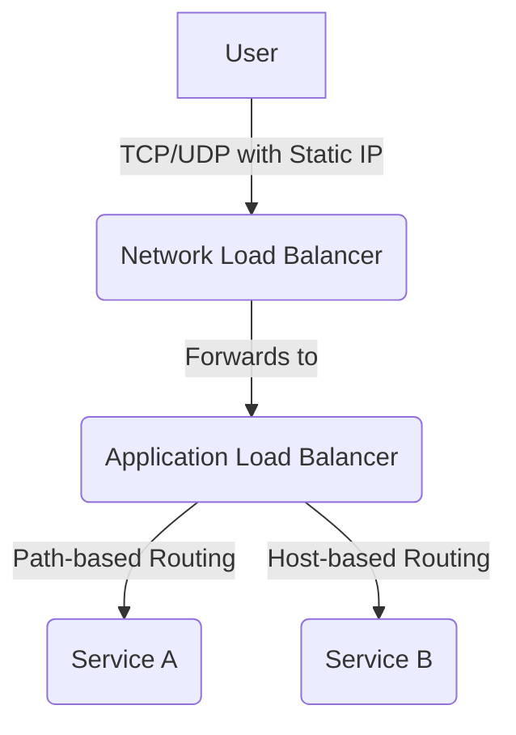
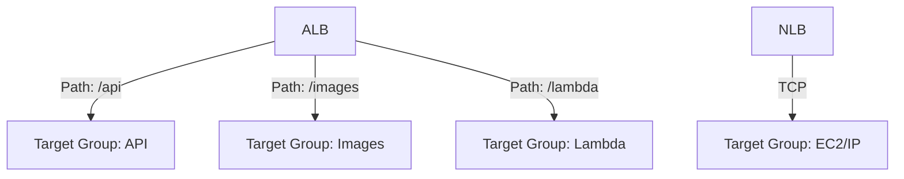

# AWS Load Balancer Comparison: ALB vs. NLB vs. GLB

## Table of Contents
- [Load Balancer Types](#load-balancer-types)
- [Key Differences: ALB vs. NLB](#key-differences-alb-vs-nlb)
- [When to Use Which Load Balancer](#when-to-use-which-load-balancer)
- [Quiz Coverage: Key Scenarios](#quiz-coverage-key-scenarios)
- [How They Work Together](#how-they-work-together)
- [Target Groups](#target-groups)
- [Further Reading](#further-reading)

---

## Load Balancer Types

| Type | OSI Layer | Protocols | Use Case |
|------|-----------|-----------|----------|
| **Application Load Balancer (ALB)** | Layer 7 (Application) | HTTP/1.1, HTTP/2, HTTP/3 (client-side only), gRPC, WebSocket | Web apps, microservices, content-based routing, serverless |
| **Network Load Balancer (NLB)** | Layer 4 (Transport) | TCP, UDP, TLS, SCTP | High-performance apps, gaming, IoT, preserving source IP |
| **Gateway Load Balancer (GLB)** | Layer 3 (Network) | IP-based | Security, traffic inspection, third-party virtual appliances |

## Key Differences: ALB vs. NLB

This table provides a detailed breakdown to help you choose the right load balancer for your design.

| Dimension | Application Load Balancer (ALB) | Network Load Balancer (NLB) |
| :--- | :--- | :--- |
| **OSI Layer & Protocols** | Layer 7 (HTTP/1.1, HTTP/2, HTTP/3 client-side, gRPC, WebSocket) | Layer 4 (TCP, UDP, TLS, SCTP) – preserves client IP |
| **Advanced Routing** | Yes. Path, host, HTTP header, query string, and source IP-based routing. Supports authentication via Cognito/OIDC and AWS WAF integration. | No. Simple routing based on port and IP (flow-based). |
| **Performance** | Higher latency (~400 ms), scales automatically. | Ultra-low latency (single-digit ms), handles millions of req/s. Supports static/elastic IPs. |
| **TLS Termination** | Yes. Terminates TLS on the load balancer (TLS 1.2-1.3). Backend policy is fixed. | Yes. Full TLS termination & SNI routing with custom security policies at L4. |
| **Stickiness** | Yes. Duration-based or application-based cookies. Can be disabled. | No stickiness supported. |
| **Client IP** | IP is forwarded in the `X-Forwarded-For` header. Not preserved by default. | Preserved automatically to targets. |
| **Pricing Unit** | Per-hour + **LCU** (requests, active connections, bandwidth, rule evaluations). | Per-hour + **LCU** (newer definition oriented to Mbps, new flows, and active connections). |
| **Capacity Reservation**| LCU (Load Balancer Capacity Unit) reservations available to pre-warm, including on Outposts. | Capacity reservations available (as of Feb 2025), including on Outposts. |
| **WAF Integration** | Direct integration with AWS WAF. | No direct integration. |
| **Disable AZ** | Can disable an Availability Zone without deleting the LB. | Can disable an Availability Zone without deleting the LB. |
| **gRPC Support** | Supports HTTP/2 and gRPC, including path-based routing for gRPC streams. | No gRPC support. |
| **HTTP/3 End-to-End** | Not supported (client-side only). | Not supported. |

## When to Use Which Load Balancer

### Application Load Balancer (ALB)
- **Complex Routing:** When you need to route traffic based on application-level information like paths (`/api`, `/images`), hostnames, or headers.
- **Microservices & Containers:** Perfect for directing traffic to different services based on the content of the request.
- **Security Integration:** When you need to integrate AWS WAF for web application security or use built-in authentication (OIDC, Cognito).
- **Serverless:** When your target is an AWS Lambda function.
- **gRPC Streams:** Supports path-based routing for gRPC streams.
- **Disable AZ:** Can disable an AZ without deleting the LB.

### Network Load Balancer (NLB)
- **Ultra-High Performance:** For applications requiring minimal latency and the ability to handle millions of requests per second (e.g., real-time bidding, gaming).
- **Static IP Address:** When consumers of your service need a fixed IP address to whitelist.
- **Source IP Preservation:** When your backend instances need the original client IP address for logging, analytics, or security.
- **Non-HTTP Traffic:** For TCP/UDP-based applications like IoT, VoIP, and media streaming.
- **TLS Termination & SNI at L4:** Supports TLS termination and SNI-based routing at Layer 4.
- **Disable AZ:** Can disable an AZ without deleting the LB.

---

## How They Work Together

While ALBs and NLBs are distinct, they can be used together in a single architecture. For example, you could use an NLB to provide a static entry IP and handle initial TCP connections, then forward traffic to an ALB for more advanced, content-based routing.

---

## Target Groups

Target Groups are a fundamental concept in AWS Elastic Load Balancing. They define how traffic is distributed to registered targets (EC2 instances, IP addresses, Lambda functions, or containers) and enable health checks, routing, and scaling.

### Types of Target Groups
| Type         | Supported By | Targets         | Use Case                                 |
|--------------|--------------|----------------|------------------------------------------|
| **Instance** | ALB, NLB     | EC2 instances  | Traditional deployments, auto scaling    |
| **IP**       | ALB, NLB     | IP addresses   | Microservices, containers, hybrid cloud  |
| **Lambda**   | ALB          | Lambda         | Serverless applications                  |
| **Application** | GLB        | Virtual appliances | Security, traffic inspection         |

### Key Features
- **Health Checks:** Load balancers use target group health checks to determine which targets are healthy and can receive traffic.
- **Routing:** ALB supports advanced routing to different target groups based on rules (path, host, header, etc.). NLB routes based on flow (IP/port).
- **Port Mapping:** Each target group can listen on a specific port, allowing flexible backend architectures.
- **Target Registration:** Targets can be dynamically registered/deregistered, supporting auto scaling and rolling deployments.

### How Target Groups Work with Load Balancers
- **ALB:** Routes requests to target groups based on listener rules. Supports multiple target groups for microservices and Lambda.
- **NLB:** Routes TCP/UDP flows to target groups, preserving source IP. Supports instance and IP target types.
- **GLB:** Routes traffic to virtual appliances via target groups for inspection and security.

### Example Architecture
You can use multiple target groups to direct traffic to different services or environments (e.g., blue/green deployments, microservices, serverless backends).

---

## Further Reading

- [Elastic Load Balancing Features](https://aws.amazon.com/elasticloadbalancing/features/)
- [What is an Application Load Balancer?](https://docs.aws.amazon.com/elasticloadbalancing/latest/application/introduction.html)
- [What is a Network Load Balancer?](https://docs.aws.amazon.com/elasticloadbalancing/latest/network/introduction.html)
- [New – TLS Termination for Network Load Balancers](https://aws.amazon.com/blogs/aws/new-tls-termination-for-network-load-balancers/)
- [Target Groups for Your Load Balancer](https://docs.aws.amazon.com/elasticloadbalancing/latest/application/load-balancer-target-groups.html)
- [Register Targets with Your Target Group](https://docs.aws.amazon.com/elasticloadbalancing/latest/application/register-targets.html)