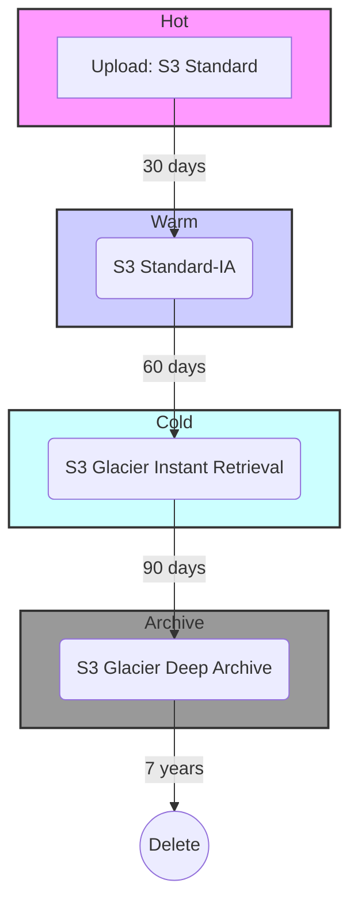

### Brief: S3 Data Lifecycle for Financial Documents

#### 📘 Context

In our Robo-Advisor application, we handle a high volume of financial documents, such as customer statements, trade confirmations, and annual reports. These documents follow a predictable access pattern: they are frequently accessed by customers and internal staff for the first few months, after which access becomes rare. However, due to strict financial regulations (e.g., SEC Rule 17a-4, FINRA rules), we must retain these documents securely for a minimum of seven years.

An S3 lifecycle policy allows us to automate the migration of this data to more cost-effective storage tiers over time, significantly reducing storage costs without compromising on compliance or retrieval needs.

#### 🔁 Lifecycle Strategy & Visualization

We can define a multi-phased strategy that balances access speed with storage cost. The data transitions from "hot" (frequently accessed) to "deep archive" (long-term retention) automatically.



**Lifecycle Phases:**

| Phase | Storage Class | Transition After | Purpose |
| :--- | :--- | :--- | :--- |
| **Hot Access** | S3 Standard | Day 0 | Immediate, frequent access. Highest cost, lowest latency. |
| **Warm Archive** | S3 Standard-IA | 30 days | Infrequent access. Lower storage cost, but with a retrieval fee. |
| **Cold Archive** | S3 Glacier Instant Retrieval | 90 days | Archival data that still requires millisecond retrieval. |
| **Deep Archive** | S3 Glacier Deep Archive | 180 days | Long-term compliance. Lowest storage cost, retrieval takes hours. |
| **Deletion** | N/A | 2557 days (7 years) | Permanent deletion after the compliance period ends. |

#### ⚖️ Trade-Offs & Architectural Considerations

*   **Cost vs. Retrieval Time:** The primary trade-off is between the monthly storage cost and the time/cost to retrieve the data. S3 Standard is expensive to store but cheap to access, while Glacier Deep Archive is extremely cheap to store but slower and more expensive to retrieve from.
*   **Object Size:** Lifecycle transition rules are applied on a per-object basis. Small objects can incur higher relative costs for transitions and retrievals, so it's often better to aggregate small documents (e.g., daily trade slips) into larger archives (e.g., a monthly ZIP file) before uploading.
*   **Retrieval Patterns:** S3 Standard-IA and Glacier Instant Retrieval have a per-GB retrieval fee. This makes them ideal for data that is *truly* infrequently accessed. If there's a chance that "warm" or "cold" data might be accessed in bulk unexpectedly, the retrieval costs could negate the storage savings.

####  Terraform Implementation Snippet

Here is how you would define this lifecycle policy on an S3 bucket using Terraform. This ensures the configuration is version-controlled and repeatable.

```terraform
resource "aws_s3_bucket_lifecycle_configuration" "financial_docs_lifecycle" {
  bucket = "robo-advisor-financial-documents" # Replace with your bucket name

  rule {
    id     = "document-lifecycle-policy"
    status = "Enabled"

    # Transition to Standard-IA after 30 days
    transition {
      days          = 30
      storage_class = "STANDARD_IA"
    }

    # Transition to Glacier Instant Retrieval after 90 days
    transition {
      days          = 90
      storage_class = "GLACIER_IR"
    }

    # Transition to Glacier Deep Archive after 180 days for long-term storage
    transition {
      days          = 180
      storage_class = "DEEP_ARCHIVE"
    }

    # Expire objects after 7 years (2557 days)
    expiration {
      days = 2557
    }

    # Clean up incomplete multipart uploads after 7 days
    abort_incomplete_multipart_upload {
      days_after_initiation = 7
    }
  }
}
```

### 1. Would Intelligent-Tiering simplify this?

Yes, S3 Intelligent-Tiering could significantly simplify the lifecycle management, but it comes with its own set of trade-offs.

**How it Simplifies:**

Instead of defining explicit day-based rules for transitions (e.g., move after 30 days, then 90, etc.), Intelligent-Tiering automates this process. It monitors the access patterns of each object and automatically moves it between two tiers: a **Frequent Access** tier (priced like S3 Standard) and an **Infrequent Access** tier (priced like S3 Standard-IA).

You simply place the data in the Intelligent-Tiering class, and S3 handles the optimization. This is ideal when access patterns are unpredictable or vary per-document.

**The Trade-Offs:**

*   **Cost Structure:** There is a small monthly monitoring and automation fee for each object stored in the Intelligent-Tiering class. For a very large number of small documents, this can add up.
*   **Less Control:** You are handing over control to AWS. For financial documents with highly predictable access patterns (e.g., almost zero access after 90 days), a manual lifecycle rule is more explicit and can be slightly more cost-effective as it avoids the monitoring fee.
*   **Archive Tiers:** By default, Intelligent-Tiering only automates between frequent and infrequent tiers. You still need to configure it to *optionally* move data to the **Archive Access** (Glacier Instant Retrieval) and **Deep Archive Access** (Glacier Deep Archive) tiers after a set number of days of no access (minimum 90).

**Verdict:** For the Robo-Advisor, if the access patterns are as predictable as we assume, a manual lifecycle policy offers the most control and likely the lowest cost. If we found that access patterns were actually sporadic and unpredictable, Intelligent-Tiering would be a superior choice to simplify operations.

---

### 2. Should lifecycle rules vary by document type?

Yes, absolutely. Applying a one-size-fits-all policy is simple, but tailoring rules by document type is a much more architecturally sound and cost-effective approach.

Different documents have different business contexts and regulatory requirements.

*   **Tax Documents (e.g., 1099 forms):** These have a very long retention period (7+ years) but might see a small spike in access years after generation during audits or when a user is filing back-taxes. Their lifecycle might warrant a longer stay in a warmer tier before moving to Deep Archive.
*   **Monthly Portfolio Statements:** These are accessed frequently for the first 30-45 days and then almost never again. They are perfect candidates for aggressive lifecycle rules that move them to colder storage quickly.
*   **Trade Confirmations:** These are generated frequently and may need to be accessed quickly for a short period to handle disputes. They could be aggregated into monthly reports and then archived.

**Implementation Strategy:**

The best way to implement this is by using S3 prefixes or object tags. You would store different document types in different "folders" (prefixes) or apply a tag like `doc_type = "tax_form"`. You can then create specific lifecycle rules that apply only to objects with that prefix or tag.

**Example Terraform with Tag-Based Rule:**

```terraform
resource "aws_s3_bucket_lifecycle_configuration" "financial_docs_lifecycle" {
  bucket = "robo-advisor-financial-documents"

  # Rule for highly sensitive tax documents
  rule {
    id     = "tax-document-policy"
    status = "Enabled"

    filter {
      tag = {
        name  = "doc_type"
        value = "tax_form"
      }
    }

    # Keep in Standard-IA for a full year before archiving
    transition {
      days          = 365
      storage_class = "GLACIER_DEEP_ARCHIVE"
    }

    expiration {
      days = 3652 # 10 years for extra safety
    }
  }

  # More aggressive rule for general statements
  rule {
    id     = "statement-policy"
    status = "Enabled"

    filter {
      prefix = "statements/"
    }
    
    # Moves to Deep Archive after 180 days
    transition {
      days          = 180
      storage_class = "DEEP_ARCHIVE"
    }

    expiration {
      days = 2557 # 7 years
    }
  }
}
```

---

### 3. What’s the cost delta between Glacier vs. Deep Archive over 7 years?

The cost difference is substantial and highlights the importance of choosing the right archival tier. Let's model the storage cost for **1 TB** of data over a **7-year** retention period, using pricing for the `us-east-1` (N. Virginia) region for comparison.

| Storage Class | Cost per GB/Month | Cost for 1 TB per Month | Total Cost for 1 TB over 7 Years |
| :--- | :--- | :--- | :--- |
| S3 Glacier Instant Retrieval | ~$0.004 | ~$4.10 | **~$344** |
| S3 Glacier Flexible Retrieval | ~$0.0036 | ~$3.69 | **~$310** |
| S3 Glacier Deep Archive | **~$0.00099** | **~$1.01** | **~$85** |

*(Note: Prices are approximate and can change. This calculation excludes retrieval costs.)*

**Analysis:**

For long-term archival where data is unlikely to be accessed, **S3 Glacier Deep Archive is nearly 4 times cheaper than Glacier Instant Retrieval and over 3.5 times cheaper than Glacier Flexible Retrieval** for storage alone.

**The Critical Trade-Off: Retrieval Time & Cost**

The massive storage savings from Deep Archive come at the cost of retrieval time.

*   **Glacier Instant Retrieval:** Millisecond access, but higher storage cost.
*   **Glacier Flexible Retrieval:** Retrieval in minutes (expedited) or hours (standard), with moderate storage cost.
*   **Glacier Deep Archive:** Standard retrieval takes **12 hours**. This is acceptable for compliance-driven retention where immediate access is not a business requirement, but it's unsuitable for any regular operational needs.
