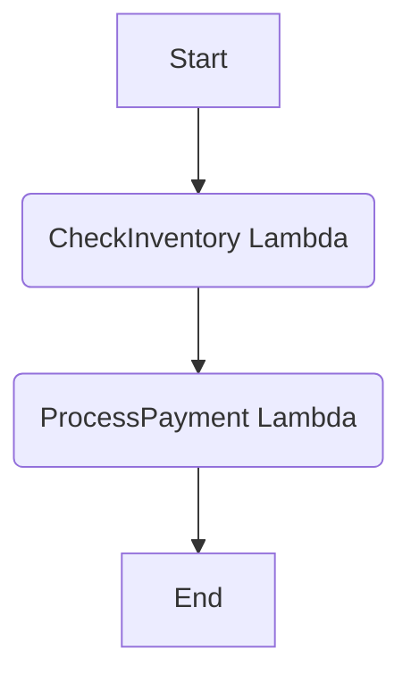
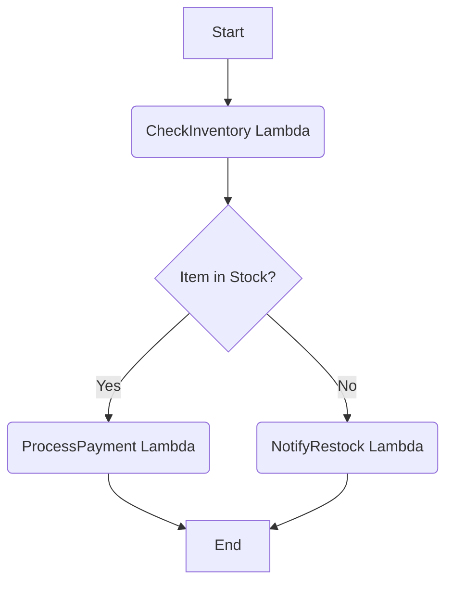
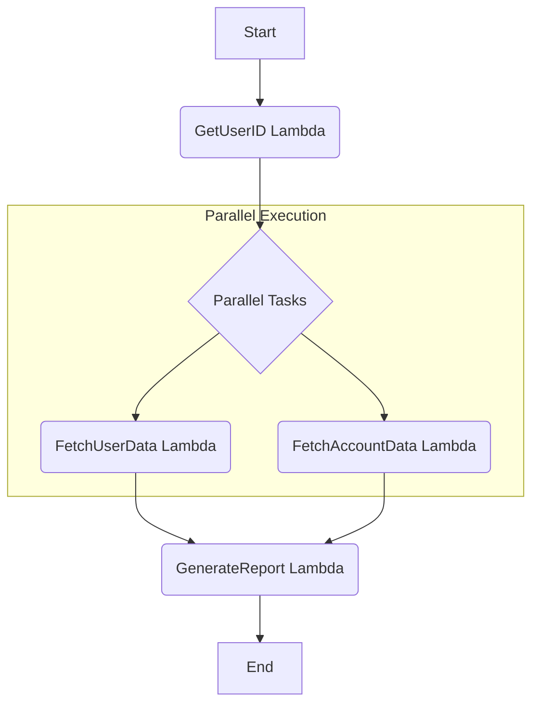
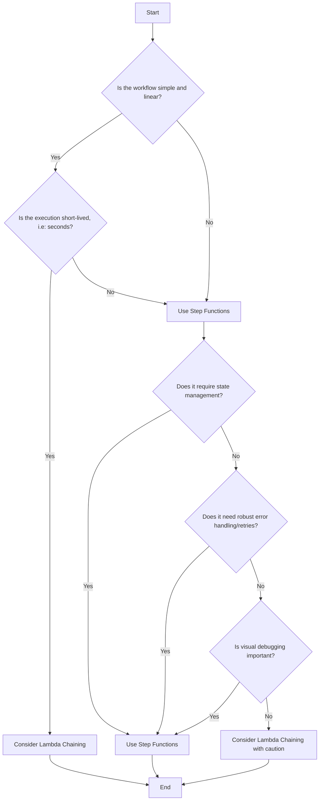

# AWS Step Functions Overview

AWS Step Functions is a serverless orchestration service that lets you coordinate multiple AWS services into serverless workflows. It allows you to build and update apps quickly.

## Core Concepts

*   **State Machine:** A workflow defined in Amazon States Language (ASL). It's a series of steps, with the output of one step acting as the input for the next.
*   **State:** A single step in a state machine. A state can be a task, a choice, a wait state, a parallel state, a map state, or a pass state.
*   **Task:** A state that represents a unit of work performed by another AWS service, such as an AWS Lambda function.
*   **Choice:** A state that adds branching logic to a state machine.
*   **Wait:** A state that delays the state machine from continuing for a specified time.
*   **Parallel:** A state that can be used to create parallel branches of execution in your state machine.
*   **Map:** A state that can be used to run a set of steps for each element of an input array.
*   **Pass:** A state that simply passes its input to its output, without performing any work. Pass states are useful for debugging and for transforming data.
*   **Execution:** An instance of a state machine that is running.

## Orchestrating Lambda Functions: Examples

One of the most common use cases for AWS Step Functions is to orchestrate multiple AWS Lambda functions into a cohesive workflow. This approach decouples the functions from each other, making them more modular, and provides robust error handling, retries, and state management out-of-the-box.

### Example 1: Simple Sequential Workflow

Imagine you have a process where you first need to `CheckInventory` and then, if successful, `ProcessPayment`.

**Workflow:**
1.  **CheckInventory Function:** A Lambda function that checks if an item is in stock.
2.  **ProcessPayment Function:** A Lambda function that processes the payment for the item.

**Diagram:**


**Amazon States Language (ASL) Definition:**
```json
{
  "Comment": "A simple sequential workflow with two Lambda functions.",
  "StartAt": "CheckInventory",
  "States": {
    "CheckInventory": {
      "Type": "Task",
      "Resource": "arn:aws:lambda:us-east-1:123456789012:function:CheckInventory",
      "Next": "ProcessPayment"
    },
    "ProcessPayment": {
      "Type": "Task",
      "Resource": "arn:aws:lambda:us-east-1:123456789012:function:ProcessPayment",
      "End": true
    }
  }
}
```
*(Note: Replace the Lambda ARNs with your actual function ARNs.)*

### Example 2: Workflow with Branching (Choice State)

Let's expand on the previous example. After checking the inventory, the workflow should proceed differently based on whether the item is in stock.

**Workflow:**
1.  **CheckInventory Function:** Returns a JSON object, for example `{"in_stock": true}`.
2.  **Choice State:** Checks the `in_stock` field from the output of the `CheckInventory` function.
    *   If `in_stock` is `true`, it proceeds to the `ProcessPayment` function.
    *   If `in_stock` is `false`, it goes to the `NotifyRestock` function.
3.  **ProcessPayment Function:** Processes the payment.
4.  **NotifyRestock Function:** A Lambda function that notifies staff to restock the item.

**Diagram:**


**Amazon States Language (ASL) Definition:**
```json
{
  "Comment": "A workflow with a choice based on Lambda output.",
  "StartAt": "CheckInventory",
  "States": {
    "CheckInventory": {
      "Type": "Task",
      "Resource": "arn:aws:lambda:us-east-1:123456789012:function:CheckInventory",
      "Next": "IsInStock"
    },
    "IsInStock": {
      "Type": "Choice",
      "Choices": [
        {
          "Variable": "$.in_stock",
          "BooleanEquals": true,
          "Next": "ProcessPayment"
        }
      ],
      "Default": "NotifyRestock"
    },
    "ProcessPayment": {
      "Type": "Task",
      "Resource": "arn:aws:lambda:us-east-1:123456789012:function:ProcessPayment",
      "End": true
    },
    "NotifyRestock": {
      "Type": "Task",
      "Resource": "arn:aws:lambda:us-east-1:123456789012:function:NotifyRestock",
      "End": true
    }
  }
}
```
*(Note: The `$.in_stock` path assumes your Lambda returns an object with an `in_stock` key. Adjust the JSONPath as needed based on your Lambda's output.)*

### Example 3: Workflow with Parallel Execution

Consider a scenario where you need to perform two independent actions after an initial step, like fetching user data and account data simultaneously before generating a report.

**Workflow:**
1.  **GetUserID Function:** A Lambda that gets the user's ID.
2.  **Parallel State:** Executes two branches concurrently.
    *   **Branch 1:** Calls the `FetchUserData` Lambda.
    *   **Branch 2:** Calls the `FetchAccountData` Lambda.
3.  **GenerateReport Function:** Once both branches complete, this Lambda takes their combined output (an array of results from each branch) to generate a report.

**Diagram:**


**Amazon States Language (ASL) Definition:**
```json
{
  "Comment": "A workflow with parallel Lambda execution.",
  "StartAt": "GetUserID",
  "States": {
    "GetUserID": {
      "Type": "Task",
      "Resource": "arn:aws:lambda:us-east-1:123456789012:function:GetUserID",
      "Next": "FetchDataInParallel"
    },
    "FetchDataInParallel": {
      "Type": "Parallel",
      "Next": "GenerateReport",
      "Branches": [
        {
          "StartAt": "FetchUserData",
          "States": {
            "FetchUserData": {
              "Type": "Task",
              "Resource": "arn:aws:lambda:us-east-1:123456789012:function:FetchUserData",
              "End": true
            }
          }
        },
        {
          "StartAt": "FetchAccountData",
          "States": {
            "FetchAccountData": {
              "Type": "Task",
              "Resource": "arn:aws:lambda:us-east-1:123456789012:function:FetchAccountData",
              "End": true
            }
          }
        }
      ]
    },
    "GenerateReport": {
      "Type": "Task",
      "Resource": "arn:aws:lambda:us-east-1:123456789012:function:GenerateReport",
      "End": true
    }
  }
}
```

## Step Functions vs. Lambda Chaining

| Feature                | AWS Step Functions                                                              | Lambda Chaining                                                                    |
| ---------------------- | ------------------------------------------------------------------------------- | ----------------------------------------------------------------------------- |
| **Nature**             | Declarative, visual workflow orchestration                                      | Imperative, code-based orchestration                                          |
| **State Management**   | Built-in, managed state between steps                                           | Requires custom implementation (e.g., passing payloads, DynamoDB)             |
| **Error Handling**     | Centralized, with built-in retry and catch logic                                | Implemented in code within each function, can be complex                      |
| **Visibility & Debugging** | Visual execution history, easy to trace and debug                               | Difficult, requires log correlation across multiple functions                 |
| **Execution Time**     | Standard workflows can run for up to a year                                     | Limited by the 15-minute maximum execution time of a single Lambda            |
| **Cost**               | Priced per state transition                                                     | Priced per invocation and total execution duration                            |

## Key Trade-offs: Step Functions vs. Lambda Chaining

Choosing between AWS Step Functions and Lambda chaining for orchestrating serverless workflows involves understanding several key trade-offs. While Lambda chaining might seem simpler for very basic scenarios, Step Functions offers significant advantages for more complex, robust, and observable workflows.

### 1. Workflow Complexity and Readability

*   **Step Functions:** Designed for complex workflows. The Amazon States Language (ASL) provides a clear, declarative way to define sequences, parallel branches, choices, and error handling. The visual workflow studio makes it easy to understand the flow at a glance, even for non-developers.
*   **Lambda Chaining:** For simple, linear flows, Lambda chaining can be quick to implement. However, as the workflow grows in complexity (e.g., adding conditional logic, retries, or parallel execution), the orchestration logic becomes embedded within the Lambda code, making it harder to read, understand, and maintain. Debugging often requires tracing logs across multiple functions.

### 2. State Management

*   **Step Functions:** Manages the state of your workflow automatically. The output of one step is seamlessly passed as input to the next. This built-in state management simplifies your Lambda functions, as they don't need to worry about persisting or retrieving state between invocations.
*   **Lambda Chaining:** Requires explicit state management. If data needs to be passed between chained Lambda functions, it must be included in the payload. For larger or more sensitive state, you would need to use an external data store like Amazon S3 or DynamoDB, adding complexity and potential points of failure.

### 3. Error Handling and Resilience

*   **Step Functions:** Offers robust, centralized error handling. You can define `Retry` policies for transient errors (e.g., service throttling) and `Catch` blocks to handle specific exceptions, allowing you to gracefully recover or transition to a different state. This makes building resilient workflows much simpler.
*   **Lambda Chaining:** Error handling must be implemented within the code of each individual Lambda function. A failure in one function can break the entire chain, and implementing comprehensive retry logic, dead-letter queues (DLQs), and fallback mechanisms across multiple functions can become very complex and error-prone.

### 4. Observability and Debugging

*   **Step Functions:** Provides excellent observability. The Step Functions console offers a visual representation of each execution, showing the path taken, inputs, outputs, and any errors. This makes it incredibly easy to debug and troubleshoot issues, even for long-running workflows.
*   **Lambda Chaining:** Debugging can be challenging. You typically need to correlate logs from multiple CloudWatch Log Streams to trace a single execution, which is time-consuming and difficult, especially for asynchronous or long-running processes.

### 5. Execution Duration

*   **Step Functions:** Standard Workflows can run for up to a year, making them suitable for long-running business processes that might involve human approvals or extended waits.
*   **Lambda Chaining:** Each individual Lambda function has a maximum execution duration of 15 minutes. While you can chain them, the overall workflow duration is limited by the sum of these individual executions, and managing long-running processes becomes cumbersome.

### 6. Cost Implications

*   **Step Functions:** Priced per state transition. For very simple, high-volume, short-lived linear workflows, the cost per state transition might be higher than direct Lambda invocations. However, for complex workflows, the cost savings from reduced development, debugging, and maintenance efforts often outweigh the per-transition cost.
*   **Lambda Chaining:** Priced per invocation and execution duration of each Lambda function. For extremely simple, short, and linear workflows, it might appear cheaper. However, the hidden costs of increased development time, debugging complexity, and lack of built-in resilience can quickly make it more expensive in the long run.

### Decision Flowchart



## When to Use Step Functions

*   **Complex, multi-step workflows:** Ideal for orchestrating processes with branching, parallelism, and long-running tasks.
*   **Business-critical processes:** The built-in error handling, state management, and visibility make it suitable for reliable applications.
*   **Workflows with human interaction:** The "callback pattern" allows workflows to pause and wait for external input, such as a manual approval.
*   **Long-running executions:** Standard Workflows can run for up to a year, making them perfect for processes that include delays or long waits.

## Best Practices

*   **Break down complex workflows into smaller, nested state machines.**
*   **Use direct service integrations (e.g., with DynamoDB, SNS) to avoid unnecessary costs.**
*   **Implement timeouts and retry logic to prevent infinite loops and handle transient failures.**
*   **Keep individual tasks small and focused.**

## References

*   [AWS Lambda Documentation](https://docs.aws.amazon.com/lambda/latest/dg/welcome.html)
*   [AWS Step Functions Documentation](https://docs.aws.amazon.com/step-functions/latest/dg/welcome.html)
