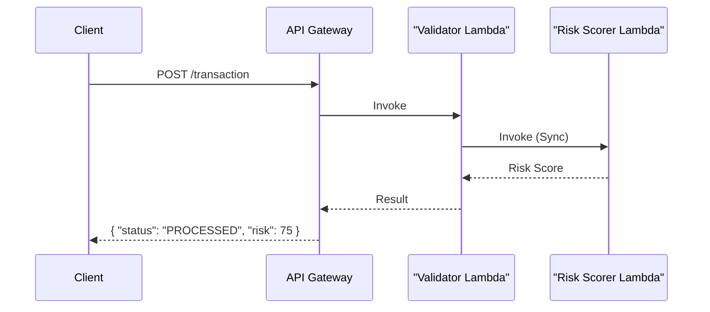
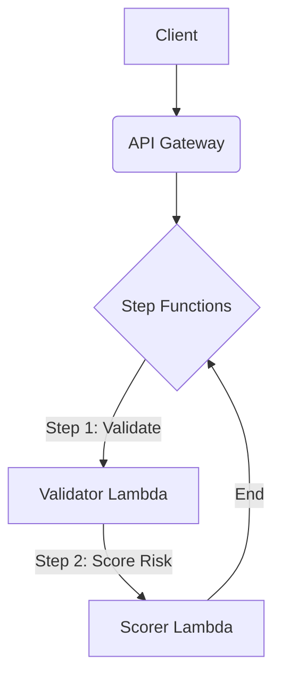

# Synchronous vs. Asynchronous Orchestration

Choosing the right orchestration strategy is critical for building resilient, scalable, and cost-effective systems. This note compares synchronous and asynchronous approaches, using AWS services as examples in a financial context.

## The Scenario: Transaction Processing

Imagine a fintech application that processes customer transactions. Each transaction requires two steps:
1.  **Validation:** Ensure the transaction has all required fields and the user account is valid.
2.  **Risk Scoring:** Analyze the transaction for potential fraud.

---

## 1. Synchronous Orchestration (Direct Lambda Chaining)

In this model, services are called in a blocking sequence. The client waits for the entire workflow to complete before receiving a response. A common implementation on AWS is chaining Lambda functions, where one Lambda function directly invokes another.

### How It Works

### Analysis

-   **Latency:** The client's perceived latency is the sum of all function execution times. It's best suited for short-lived tasks where an immediate response is mandatory.
-   **Error Handling:** Complex and brittle. If the `ScorerLambda` fails, the `ValidatorLambda` must implement custom retry logic and handle the error. A failure in one part of the chain can cause the entire process to fail.
-   **Cost:** You pay for the execution time of all Lambda functions, including the time the orchestrating Lambda (`ValidatorLambda`) waits for the downstream Lambda (`ScorerLambda`) to complete. This can become expensive if downstream processes are slow.
-   **Observability:** Tracing a request across multiple direct invocations can be challenging. While AWS X-Ray helps, it requires careful setup to correlate logs and traces effectively across the chain.
-   **Developer Productivity:** Simple for very short chains (2-3 functions). However, it quickly leads to tightly coupled services, making the system difficult to maintain, test, and modify. Adding a new step requires changing the existing code.

---

## 2. Asynchronous Orchestration (AWS Step Functions)

In this model, a central orchestrator manages the workflow, and services communicate through events or messages without waiting for an immediate response. AWS Step Functions is a purpose-built service for this.

### How It Works

### Analysis

-   **Latency:** The initial response to the client is almost immediate. The client receives an execution ID and can poll for status or be notified upon completion. The total workflow time might be longer due to state transitions, but the client is not blocked.
-   **Error Handling & Retries:** A major strength. Step Functions provides built-in, configurable support for retries with exponential backoff and dead-letter queues (DLQs) for failed executions. This logic is managed by the state machine, not the Lambda code, making functions simpler and more focused.
-   **Cost:** Step Functions has its own pricing model based on state transitions. While this adds a cost layer, it can be cheaper overall by eliminating idle "wait" time in Lambda functions and optimizing execution flow.
-   **Observability:** Excellent. The AWS Step Functions console provides a visual workflow history, showing each step's input, output, and duration. This makes it incredibly easy to debug and trace executions.
-   **Developer Productivity:** High. Developers can define the workflow in a simple JSON/YAML format. Business logic is decoupled from orchestration logic, making it easy to add, remove, or reorder steps without changing the code of individual functions.

---

## Trade-Off Summary

| Aspect                  | Synchronous (Direct Lambda Chaining)                               | Asynchronous (AWS Step Functions)                                    |
| ----------------------- | ------------------------------------------------------------------ | -------------------------------------------------------------------- |
| **Client Experience**   | Blocking call; client waits for the final result.                  | Non-blocking; client gets an immediate acknowledgment.               |
| **Latency**             | Lower end-to-end latency for short, simple workflows.              | Higher end-to-end latency, but faster initial response.              |
| **Error Handling**      | Manual, complex, and coded into each function.                     | Built-in, robust, and configurable (retries, backoff, DLQs).         |
| **Cost**                | Can be higher due to paying for idle/wait time in Lambdas.         | Pay-per-state-transition, often more cost-effective for complex flows. |
| **Observability**       | Requires custom logging and tools like X-Ray to trace flows.       | Excellent visual monitoring and logging out-of-the-box.              |
| **Coupling**            | Tightly coupled; changes in one function can impact others.        | Loosely coupled; workflow changes don't require code changes.        |
| **Best For**            | Simple, short-lived processes where an immediate response is vital. | Complex, long-running, or multi-step processes requiring resilience. |

## Conclusion

For the financial transaction example, an **asynchronous orchestration** using AWS Step Functions is the superior architectural choice. It provides the resilience, scalability, and observability required for a critical business process like risk scoring. Direct Lambda chaining should be reserved for very simple, non-critical workflows where low latency is the absolute priority and the risk of failure is minimal.
