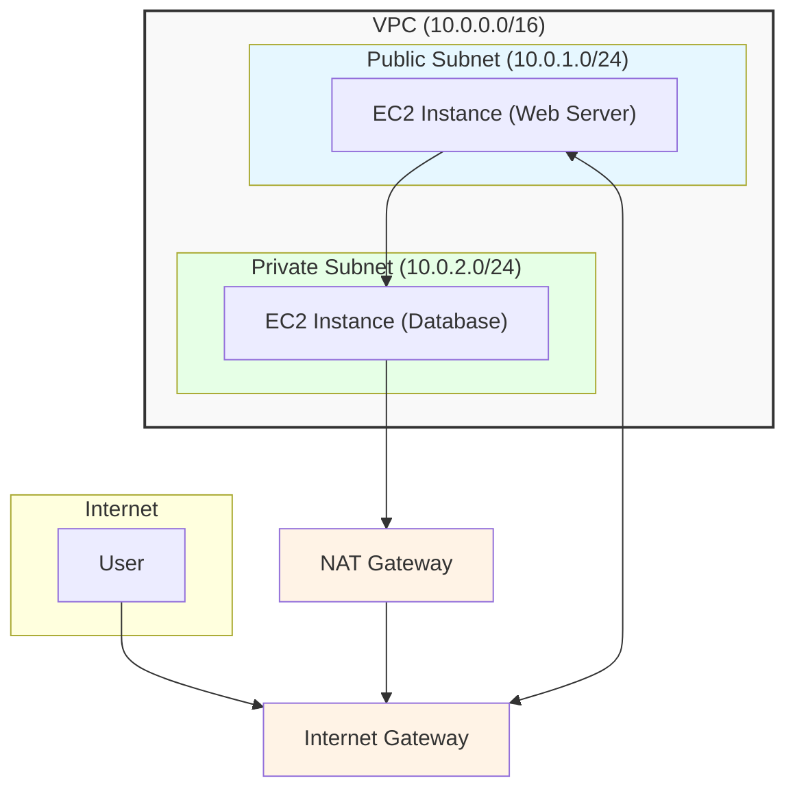
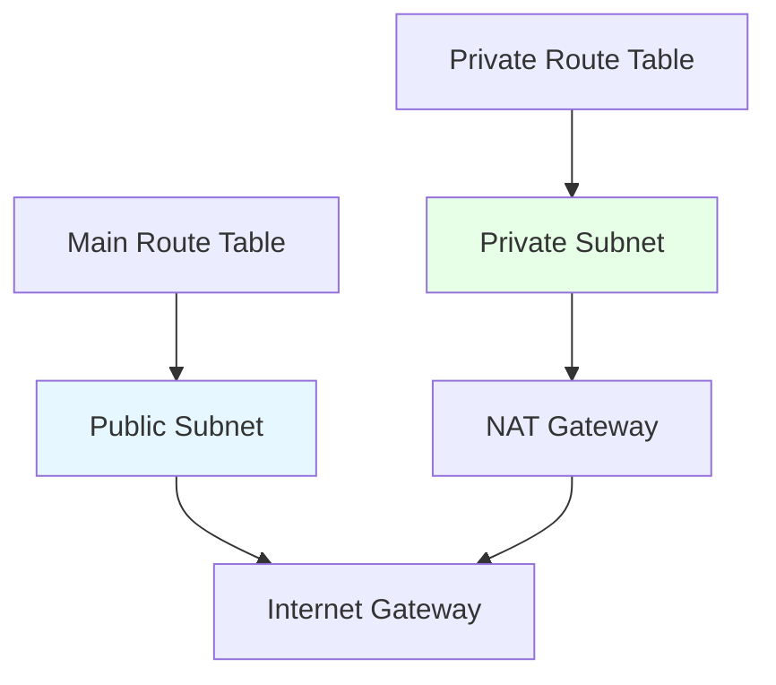
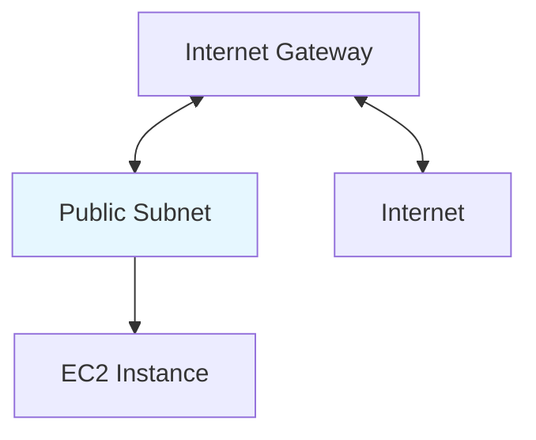
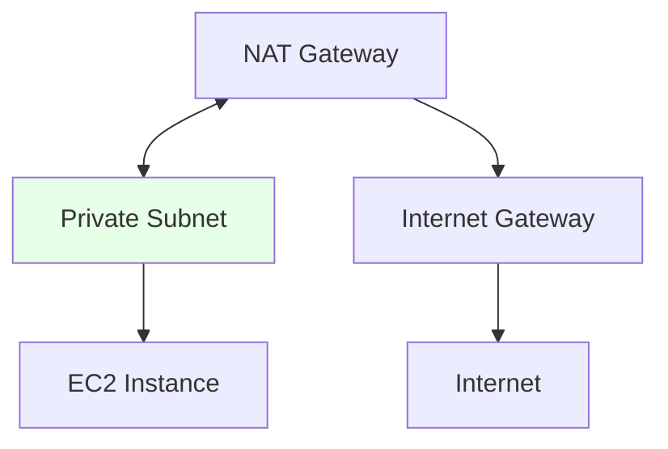

# AWS VPC Basics

## Table of Contents
- [VPC Concepts & Glossary](#vpc-concepts--glossary)
- [When to Use a VPC](#when-to-use-a-vpc)
- [When Not to Use a VPC](#when-not-to-use-a-vpc)
- [Visual: Basic VPC Architecture](#visual-basic-vpc-architecture)
- [Security Group vs NACL](#security-group-vs-nacl)
- [Common VPC Design Patterns](#common-vpc-design-patterns)
- [VPC Best Practices](#vpc-best-practices)
- [Further Reading](#further-reading)

---

## VPC Concepts & Glossary

| Term           | Definition |
|----------------|------------|
| **VPC**        | Virtual Private Cloud, a logically isolated network in AWS. |
| **Subnet**     | A range of IP addresses within a VPC. |
| **Public Subnet** | Subnet whose traffic is routed to an Internet Gateway. |
| **Private Subnet** | Subnet without a route to an Internet Gateway. |
| **IGW**        | Internet Gateway, enables internet access for VPC resources. |
| **NAT Gateway**| Allows private subnet resources to access the internet. |
| **Route Table**| Set of rules for network traffic routing. |
| **Security Group** | Virtual firewall for instances (stateful). |
| **NACL**       | Network Access Control List, firewall for subnets (stateless). |
| **VPC Peering**| Private connection between two VPCs. |
| **VPN Connection** | Encrypted connection between on-premises and AWS. |
| **Direct Connect** | Dedicated network connection to AWS. |

---

## When to Use a VPC

- **Isolating Resources:** To launch resources like EC2 instances or RDS databases in a private, secure, and isolated network.
- **Custom Network Configuration:** When you need to define your own IP address range, create public and private subnets, and configure custom routing.
- **Securing Applications:** To control inbound and outbound traffic to your applications using Security Groups and Network ACLs.
- **Hybrid Cloud:** To connect your on-premises data center to your AWS resources using a VPN connection or AWS Direct Connect.

---

## When Not to Use a VPC

- For serverless services (like S3, DynamoDB, Lambda with public endpoints) unless you need private connectivity or advanced network controls.

---

## Visual: Basic VPC Architecture

This diagram shows a common VPC setup with a public subnet for web-facing resources and a private subnet for backend resources like databases.

**Legend:**
- Blue: Public resources
- Green: Private resources
- Orange: Gateways



---

## Security Group vs NACL

| Feature           | Security Group         | Network ACL (NACL)      |
|-------------------|-----------------------|-------------------------|
| Level             | Instance              | Subnet                  |
| Stateful?         | Yes                   | No (stateless)          |
| Rules             | Allow only            | Allow & Deny            |
| Applies to        | Inbound & Outbound    | Inbound & Outbound      |
| Evaluation Order  | All rules             | Numbered, lowest first  |

---

## Common VPC Design Patterns

### 1. Public/Private Subnet Pattern
- **When to Use:**
  - You want to expose web servers to the internet but keep databases and backend services private.
  - Typical for 2-tier or 3-tier web applications.
- **Visualisation:**
  - Public subnet: Contains load balancers, web servers (with public IPs).
  - Private subnet: Contains application servers, databases (no public IPs).
  - NAT Gateway in public subnet allows private subnet resources outbound internet access.
  
  ```mermaid
  graph TD
    IGW[Internet Gateway] --> LB[Load Balancer]
    LB --> Web[Web Server]
    Web --> NAT[NAT Gateway]
    NAT --> IGW
    Web --> App[App Server]
    App --> DB[Database]
    classDef public fill:#e6f7ff;
    classDef private fill:#e6ffe6;
    class LB,Web,NAT public;
    class App,DB private;
  ```
- **Comparison:**
  - Most common pattern for secure, scalable web apps.
  - Simple to implement, good for most workloads.

---

### 2. VPC Peering
- **When to Use:**
  - You need private communication between two VPCs (e.g., shared services, multi-account setups).
  - VPCs can be in the same or different AWS accounts/regions.
- **Visualisation:**
  - Two VPCs connected via a peering link.
  - Resources in each VPC can communicate using private IPs.
  
  ```mermaid
  graph LR
    VPC1[VPC A] --- Peering --- VPC2[VPC B]
    VPC1 --> EC2A[EC2 Instance A]
    VPC2 --> EC2B[EC2 Instance B]
  ```
- **Comparison:**
  - Simple, low-latency, no transitive routing (A-B, B-C, but not A-C through B).
  - Good for small-scale, point-to-point connectivity.

---

### 3. Transit Gateway
- **When to Use:**
  - You need to connect many VPCs and on-premises networks in a hub-and-spoke model.
  - Large organizations, multi-account, multi-region architectures.
- **Visualisation:**
  - Central Transit Gateway connects to multiple VPCs and VPNs.
  
  ```mermaid
  graph TD
    TGW[Transit Gateway] --> VPC1[VPC 1]
    TGW --> VPC2[VPC 2]
    TGW --> VPC3[VPC 3]
    TGW --> VPN[On-Premises VPN]
  ```
- **Comparison:**
  - Scalable, transitive routing, centralized management.
  - More complex and higher cost than peering.

---

### 4. Hybrid Cloud (VPN/Direct Connect)
- **When to Use:**
  - You need secure, private connectivity between AWS and your on-premises data center.
  - For migration, disaster recovery, or hybrid workloads.
- **Visualisation:**
  - VPC connected to on-premises via VPN or Direct Connect.
  
  ```mermaid
  graph LR
    VPC[VPC] --- VPN[VPN Gateway] --- OnPrem[On-Premises]
    VPC --- DX[Direct Connect] --- OnPrem
  ```
- **Comparison:**
  - VPN: Quick, cost-effective, but lower bandwidth and higher latency.
  - Direct Connect: Dedicated, high bandwidth, low latency, but higher setup cost.

---

### Pattern Comparison Table

| Pattern                | Use Case                        | Scale         | Cost      | Complexity | Transitive Routing |
|------------------------|---------------------------------|--------------|-----------|------------|-------------------|
| Public/Private Subnet  | Web apps, 2/3-tier apps         | Small-Medium | Low       | Low        | N/A               |
| VPC Peering            | Point-to-point VPC connectivity | Small-Medium | Low       | Low        | No                |
| Transit Gateway        | Many VPCs, hub-and-spoke        | Large        | Medium-High| Medium     | Yes               |
| Hybrid Cloud           | On-premises integration         | Any          | Varies    | Medium     | N/A               |

---

## Practical Examples

- **Restrict SSH Access to a Specific IP:**
  - Use a Security Group rule: Allow TCP port 22 only from your office IP.
- **Use VPC Endpoints for S3:**
  - Create a VPC endpoint to privately connect your VPC to S3 without using an IGW or NAT Gateway.

---

## VPC Best Practices

- **Use Multiple Availability Zones (AZs):** Deploy your subnets and resources across multiple AZs for high availability and fault tolerance.
- **Right-Sizing CIDR Blocks:** Plan your IP address ranges carefully to avoid future conflicts or shortages.
- **Private by Default:** Place resources in private subnets unless they explicitly require direct inbound access from the internet.
- **Layered Security:** Use both Security Groups (at the instance level) and Network ACLs (at the subnet level) for defense in depth.
- **Use VPC Endpoints:** For private and secure communication between your VPC and other AWS services without requiring an IGW or NAT Gateway.

---

## Further Reading

- [What is Amazon VPC?](https://docs.aws.amazon.com/vpc/latest/userguide/what-is-amazon-vpc.html)
- [VPC User Guide](https://docs.aws.amazon.com/vpc/latest/userguide/VPC_UserGuide.pdf)
- [VPC Best Practices](https://aws.amazon.com/vpc/best-practices/)

---

## Route Tables in VPC

### What is a Route Table?
A route table in AWS VPC is a set of rules (routes) that determine where network traffic from your subnets or gateways is directed.

### When to Use Route Tables
- **Custom Routing:** When you need to control how traffic flows between subnets, to the internet, or to on-premises networks.
- **Public vs Private Subnets:** To define which subnets have internet access (public) and which do not (private).
- **VPC Peering, VPN, Direct Connect:** To enable communication between VPCs or with on-premises networks.
- **Isolating Environments:** To restrict or allow traffic between different parts of your VPC (e.g., dev, test, prod).

### Visualisation



### Example: Public and Private Subnet Routing
- **Public Subnet Route Table:**
  - Destination: `0.0.0.0/0` → Target: Internet Gateway (IGW)
- **Private Subnet Route Table:**
  - Destination: `0.0.0.0/0` → Target: NAT Gateway (for outbound internet only)

**Terraform Example:**
```hcl
resource "aws_route_table" "public" {
  vpc_id = aws_vpc.main.id
  route {
    cidr_block = "0.0.0.0/0"
    gateway_id = aws_internet_gateway.gw.id
  }
}

resource "aws_route_table" "private" {
  vpc_id = aws_vpc.main.id
  route {
    cidr_block = "0.0.0.0/0"
    nat_gateway_id = aws_nat_gateway.nat.id
  }
}

resource "aws_route_table_association" "public" {
  subnet_id      = aws_subnet.public.id
  route_table_id = aws_route_table.public.id
}

resource "aws_route_table_association" "private" {
  subnet_id      = aws_subnet.private.id
  route_table_id = aws_route_table.private.id
}
```

### Key Points
- Each subnet must be associated with a route table (explicitly or implicitly).
- The main route table is used by default unless you associate a subnet with a custom route table.
- Use separate route tables to control access and traffic flow for different subnet types or network segments.

---

## Internet Gateway (IGW)

### What is an Internet Gateway?
An Internet Gateway is a horizontally scaled, redundant, and highly available VPC component that allows communication between resources in your VPC and the internet.

### When to Use an Internet Gateway
- **Public Subnets:** When you want resources (like web servers) in your VPC to have direct access to and from the internet.
- **Inbound/Outbound Traffic:** For both inbound (e.g., HTTP/HTTPS) and outbound (e.g., software updates) internet access.

### Visualisation


### Example: Attaching an IGW
**Terraform Example:**
```hcl
resource "aws_internet_gateway" "gw" {
  vpc_id = aws_vpc.main.id
}

resource "aws_route_table" "public" {
  vpc_id = aws_vpc.main.id
  route {
    cidr_block = "0.0.0.0/0"
    gateway_id = aws_internet_gateway.gw.id
  }
}
```

### Key Points
- Only one IGW can be attached to a VPC at a time.
- Required for public subnets to access the internet.
- No cost for IGW itself, but data transfer charges apply.

---

## NAT Gateway

### What is a NAT Gateway?
A NAT (Network Address Translation) Gateway enables instances in a private subnet to connect to the internet or other AWS services, but prevents the internet from initiating connections with those instances.

### When to Use a NAT Gateway
- **Private Subnets:** When you want resources in private subnets to access the internet (e.g., for updates) but not be directly reachable from the internet.
- **Outbound-Only Access:** For scenarios where only outbound internet access is needed for private resources.

### Visualisation


### Example: Deploying a NAT Gateway
**Terraform Example:**
```hcl
resource "aws_nat_gateway" "nat" {
  allocation_id = aws_eip.nat.id
  subnet_id     = aws_subnet.public.id
}

resource "aws_eip" "nat" {
  vpc = true
}

resource "aws_route_table" "private" {
  vpc_id = aws_vpc.main.id
  route {
    cidr_block     = "0.0.0.0/0"
    nat_gateway_id = aws_nat_gateway.nat.id
  }
}
```

### Key Points
- NAT Gateway must be deployed in a public subnet.
- Requires an Elastic IP address.
- Used for secure, outbound-only internet access from private subnets.
- NAT Gateway incurs hourly and data processing charges.
