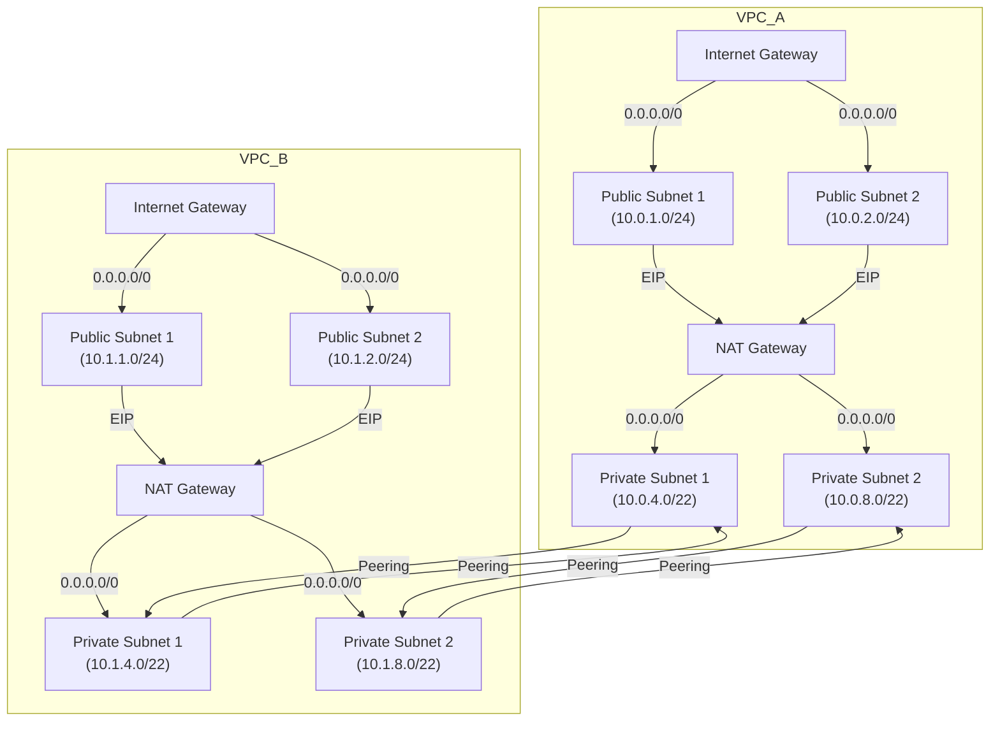

# ADR-001: Subnetting and Routing Decisions

## Status
Accepted

## Context
To support multi-tier architecture and ensure secure and scalable network design, two VPCs are configured:
- **VPC-A** (e.g., app network)
- **VPC-B** (e.g., data network)

Each VPC contains:
- Public subnets (for NAT, ALB)
- Private subnets (for EC2, RDS)

Routing decisions affect reachability, internet access, and inter-VPC communication.

## Decision
- **CIDR Blocks**:  
  - VPC-A: `10.0.0.0/16`  
  - VPC-B: `10.1.0.0/16`

- **Subnet Layout**:  
  - Public subnets: `/24` per AZ  
  - Private subnets: `/22` per AZ

- **Routing Rules**:
  - Public subnets route `0.0.0.0/0` via **Internet Gateway**
  - Private subnets route `0.0.0.0/0` via **NAT Gateway**
  - VPC Peering routes added for cross-VPC traffic

- **Peering Configuration**:  
  - VPC-A ↔ VPC-B peering established  
  - Route tables updated on both sides

## Network Diagram

## Rationale
- Enables public web access and private service isolation
- Peering allows communication without exposing resources to internet
- NAT provides secure outbound access for private subnets

## Consequences
- Slight cost increase due to NAT Gateway
- Requires route table hygiene and ACL checks
- Scalability maintained through modular subnetting

## Alternatives Considered
- Centralized Transit Gateway (too early-stage for this setup)
- Flat single VPC (less separation of concerns)