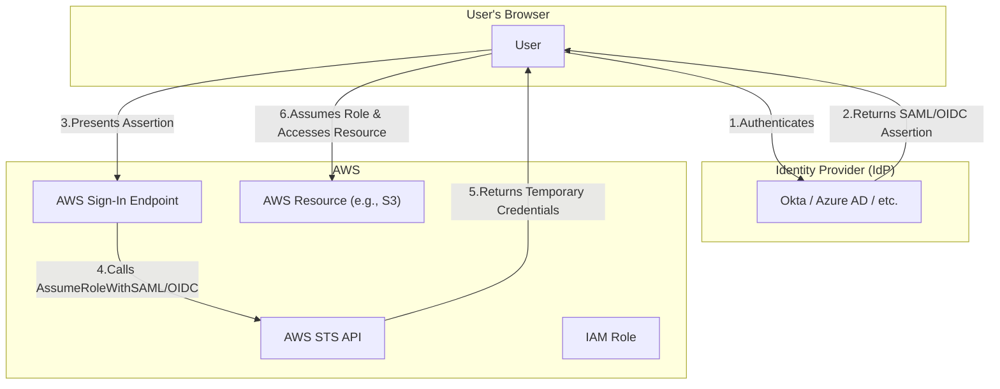

# Federated Identity in AWS

## Table of Contents
- [Federated Identity Concepts & Glossary](#federated-identity-concepts--glossary)
- [When to Use Federated Identity](#when-to-use-federated-identity)
- [How Federated Identity Works in AWS](#how-federated-identity-works-in-aws)
- [Practical Example](#practical-example)
- [Comparison Table: IAM Identities](#comparison-table-iam-identities)
- [Visual: Federated Identity Flow](#visual-federated-identity-flow)
- [Further Reading](#further-reading)

---

## Federated Identity Concepts & Glossary

| Term | Definition |
|------|------------|
| **Identity Provider (IdP)** | The system that manages and authenticates the user's identity (e.g., Okta, Azure AD, Google Workspace, or on-premise AD). |
| **Service Provider (SP)** | The service the user wants to access (AWS). |
| **SAML 2.0** | Open standard for exchanging authentication and authorization data between an IdP and an SP. |
| **OpenID Connect (OIDC)** | Identity layer built on top of OAuth 2.0, used for social and enterprise IdPs. |
| **IAM Role** | AWS identity with specific permissions that can be assumed by trusted entities. |
| **STS (Security Token Service)** | AWS service that issues temporary credentials. |

---

## When to Use Federated Identity

- **Single Sign-On (SSO):** When you want users to access the AWS Management Console or CLI using their existing corporate credentials.
- **Temporary Access:** When you need to grant short-lived access to AWS resources to contractors, partners, or applications.
- **Centralized Identity Management:** When you want to continue managing users and groups in your existing corporate directory (e.g., Active Directory, Google Workspace, Okta).
- **Reducing IAM User Sprawl:** To avoid creating and managing individual IAM users for every person or application that needs access.

---

## How Federated Identity Works in AWS

The general flow involves a user authenticating with their IdP and receiving a security assertion (a SAML token or OIDC JWT), which is then presented to AWS to trade for temporary credentials.

1.  **Authentication:** A user attempts to access an application that requires AWS resources. The application redirects the user to the external IdP (e.g., Okta).
2.  **Token Issuance:** The user authenticates with the IdP using their existing credentials (e.g., username/password, MFA). Upon success, the IdP generates a security assertion (SAML or OIDC token) and sends it back to the user's browser.
3.  **Assume Role Request:** The user's browser posts the assertion to AWS, calling the AWS Security Token Service (STS) API, specifically `AssumeRoleWithSAML` or `AssumeRoleWithWebIdentity`.
4.  **Credential Exchange:** AWS STS validates the assertion from the trusted IdP. If valid, STS returns temporary security credentials (access key, secret key, and session token) to the user.
5.  **Resource Access:** The user can now use these temporary credentials to assume the designated IAM Role and access the permitted AWS resources.

**AWS IAM Identity Center (formerly AWS SSO)** simplifies this entire workflow for human users by integrating with your IdP and managing the roles and permissions centrally.

---

## Practical Example: Employee Accessing S3 via Okta

1.  An employee, Jane, navigates to her company's Okta dashboard and clicks the "AWS Console" application icon.
2.  Okta, the IdP, has already authenticated Jane and sends a SAML assertion to her browser.
3.  Her browser forwards this assertion to the AWS sign-in endpoint.
4.  AWS verifies the assertion is from Okta (a trusted IdP) and calls STS to grant Jane temporary credentials for a pre-configured IAM Role (e.g., `DevelopersRole`).
5.  Jane is redirected to the AWS Management Console, where she is now logged in with the `DevelopersRole` and can access resources permitted by that role, such as specific S3 buckets.

---

## Comparison Table: IAM Identities

| Feature | IAM User | IAM Role | IAM Group | Federated Identity |
|---|---|---|---|---|
| **Definition** | An AWS identity with long-term credentials. | An AWS identity with temporary credentials, assumed by users or services. | A collection of IAM users for permission management. | An external user authenticated via an IdP, who then assumes a role. |
| **Credentials** | Permanent (access key, password). | Temporary (via STS). | N/A (contains users). | Temporary (via STS). |
| **Identity Source** | AWS IAM | AWS IAM | AWS IAM | External IdP (e.g., Azure AD, Okta, Google). |
| **Use Case** | Direct AWS access for individuals or applications native to AWS. | Delegation, cross-account access, service access, and federated access. | Applying permissions to multiple users at once. | SSO, external/corporate access, short-term access. |
| **Managed In** | AWS IAM | AWS IAM | AWS IAM | External IdP + AWS IAM |
| **Best For** | AWS-native users needing persistent access. | Delegation, automation, and federated users. | Group-based permission management. | Centralized identity, SSO, and external partners. |
| **Example** | A developer with a permanent AWS Console login. | An EC2 instance profile, a cross-account access policy, or a SAML/OIDC user. | A `Developers` group with S3 read access. | An employee logging in via Okta, Google, or Active Directory. |

---

## Visual: Federated Identity Flow

---

## Further Reading

- [AWS IAM Identity Center (Successor to AWS SSO)](https://docs.aws.amazon.com/singlesignon/latest/userguide/what-is.html)
- [Identity providers and federation in IAM](https://docs.aws.amazon.com/IAM/latest/UserGuide/id_roles_providers.html)
- [About SAML 2.0-based federation](https://docs.aws.amazon.com/IAM/latest/UserGuide/id_roles_providers_saml.html)