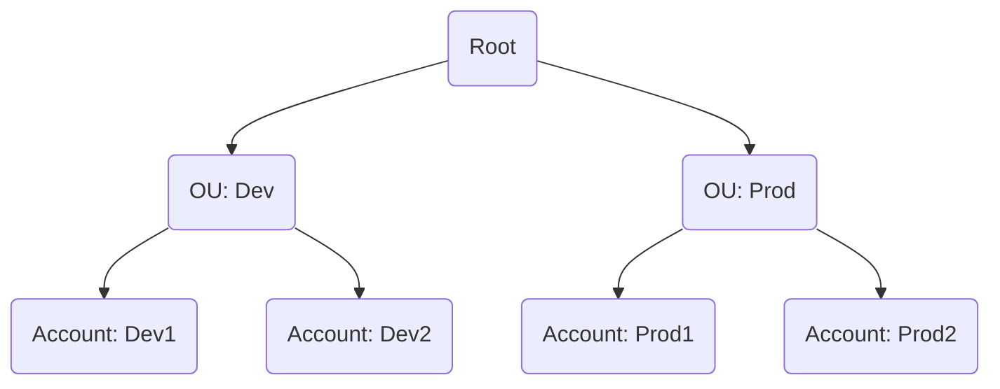
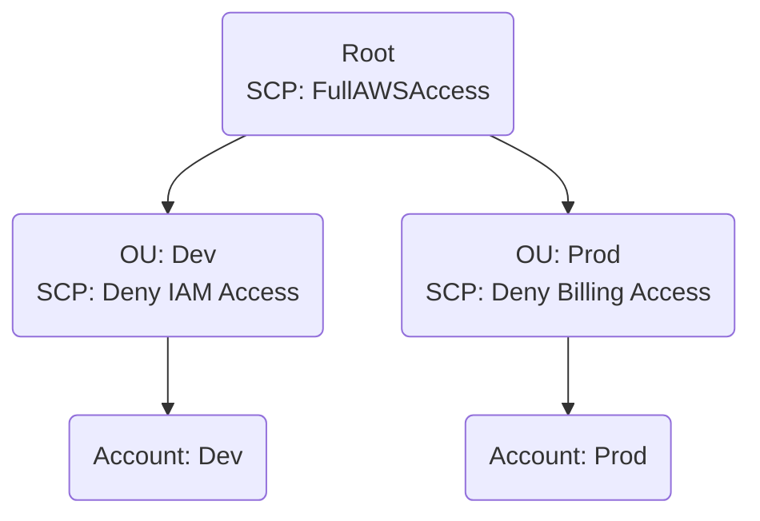

# AWS Organizations & Service Control Policies (SCPs)

## Table of Contents
- [SCP Concepts & Glossary](#scp-concepts--glossary)
- [When to Use SCPs](#when-to-use-scps)
- [How SCPs Work with IAM Policies](#how-scps-work-with-iam-policies)
- [AWS Organizations Structure](#aws-organizations-structure)
- [SCPs in Action](#scps-in-action)
- [Example: SCP Use Cases](#example-scp-use-cases)
- [Further Reading](#further-reading)

---

## SCP Concepts & Glossary

| Term | Definition |
|------|------------|
| **AWS Organizations** | Service for centrally managing and governing multiple AWS accounts. |
| **Organizational Unit (OU)** | Logical grouping of accounts within an organization. |
| **Service Control Policy (SCP)** | Policy that specifies the maximum permissions for accounts in an organization or OU. |
| **Inheritance** | SCPs attached to a parent (root or OU) are inherited by all child OUs and accounts. |

---

## When to Use SCPs

- **Enforce Guardrails:** To ensure that accounts cannot exceed the permissions defined by the SCP.
- **Compliance:** To enforce compliance with specific security or regulatory requirements.
- **Restrict Services:** To limit the use of specific AWS services or regions.

---

## How SCPs Work with IAM Policies

The final permissions for a user or role are the intersection of what is allowed by both the SCP and the IAM policies.

- If an action is blocked by an SCP, it cannot be performed, even if allowed by an IAM policy.
- If an action is not allowed by an IAM policy, it cannot be performed, even if allowed by an SCP.

---

## AWS Organizations Structure



---

## SCPs in Action



---

## Example: SCP Use Cases

### 1. Deny Access to Specific Regions

```json
{
  "Version": "2012-10-17",
  "Statement": [
    {
      "Effect": "Deny",
      "Action": "*",
      "Resource": "*",
      "Condition": {
        "StringNotEquals": {
          "aws:RequestedRegion": ["us-east-1", "eu-west-1"]
        }
      }
    }
  ]
}
```

### 2. Allow Only S3 and EC2 Services

```json
{
  "Version": "2012-10-17",
  "Statement": [
    {
      "Effect": "Allow",
      "Action": [
        "s3:*",
        "ec2:*"
      ],
      "Resource": "*"
    }
  ]
}
```

---

## SCP Best Practices

- **Start with FullAWSAccess:** Begin by applying the default `FullAWSAccess` SCP to OUs and accounts.
- **Use Deny Statements for Guardrails:** It is safer and more explicit to use `Deny` statements to block unwanted actions.
- **Test in a Sandbox:** Always apply and test new SCPs in a dedicated sandbox or development OU.
- **Monitor with AWS CloudTrail:** Use CloudTrail to log and monitor all policy changes and API calls.

---

## Further Reading

- [AWS Organizations Documentation](https://docs.aws.amazon.com/organizations/latest/userguide/orgs_introduction.html)
- [Service Control Policies](https://docs.aws.amazon.com/organizations/latest/userguide/orgs_manage_policies_scps.html)
- [SCP Examples](https://docs.aws.amazon.com/organizations/latest/userguide/orgs_manage_policies_scps_examples.html)