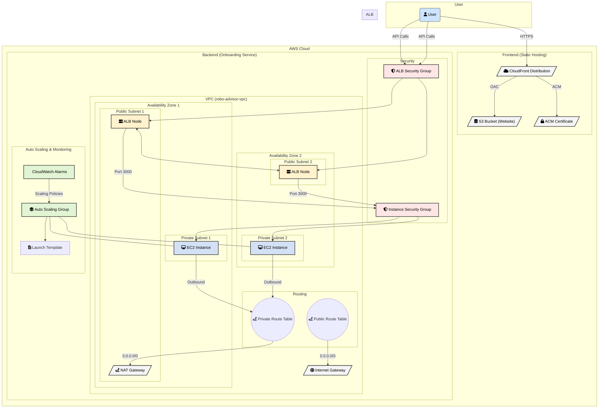

# Robo-Advisor Architecture Explained

## 1. What the Robo-Advisor Architecture Does

The current M1 architecture is composed of two primary systems:
- **Frontend**: A static React application hosted in an S3 bucket. It's served to users globally via CloudFront, which provides low-latency content delivery and a secure HTTPS connection using an ACM certificate.
- **Backend (Onboarding Service)**: A web service running on EC2 instances within a custom VPC. This service handles the initial user onboarding logic. It is designed for high availability and scalability from the ground up.

## 2. How It Scales and Secures Traffic

- **Scaling**: 
  - The backend relies on an **Auto Scaling Group (ASG)** that automatically adds or removes EC2 instances based on real-time load. 
  - It uses a **target tracking policy** based on the number of requests per target from the Application Load Balancer (ALB), ensuring the compute capacity always matches user demand.
  - The frontend on S3/CloudFront scales automatically to handle traffic spikes without any intervention.

- **Security**:
  - **Network Isolation**: The entire backend runs in a VPC with **public and private subnets**. The EC2 instances are located in private subnets, making them inaccessible from the public internet.
  - **Controlled Traffic Flow**: An **Application Load Balancer (ALB)** in the public subnet serves as the single entry point for all API traffic. **Security Groups** are used to create a strict firewall, ensuring instances only accept traffic from the ALB on the designated application port.
  - **Secure Frontend**: CloudFront uses **Origin Access Control (OAC)** to privately access the S3 bucket, preventing anyone from bypassing the CDN and accessing the website content directly.

## 3. Where I'd Improve the Current Setup

While the foundation is solid, several improvements could be made for a production-grade system:

1.  **Implement AWS WAF**: The most critical next step is to attach a **Web Application Firewall (WAF)** to the Application Load Balancer. This would provide immediate protection against common web exploits (like SQL injection, XSS) and add a layer of defense against DDoS attacks.
2.  **Decouple with SQS**: For the onboarding process, I would introduce an **SQS queue** to decouple the initial user request from the backend processing. This would make the system more resilient to traffic spikes and downstream failures. The user gets an immediate response, while the heavy lifting happens asynchronously.
3.  **Optimize Instance Launch Time**: I would create a **"Golden AMI"** with all application dependencies and configurations pre-baked. This would significantly reduce the time it takes for a new EC2 instance to become operational during a scale-out event.

